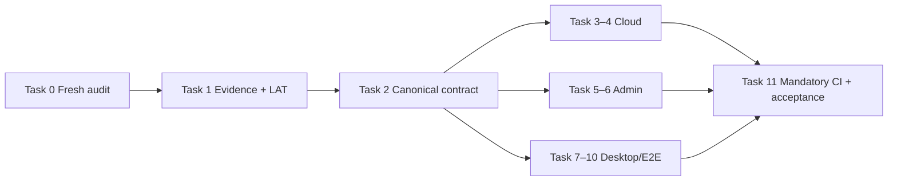

# Shared Agent Wave 0–1 Implementation Plan

> **For agentic workers:** REQUIRED SUB-SKILL: Use superpowers:subagent-driven-development (recommended) or superpowers:executing-plans to implement this plan task-by-task. Steps use checkbox (`- [ ]`) syntax for tracking.

**Goal:** 在不共享 Runtime Profile、Memory、USER、会话、文件或凭据的前提下，补齐共享 Agent 的独立审核、官方治理、可靠安装、会话冻结、生命周期和发布级证据，使个人、企业与官方 Agent 达到可验证的 Wave 1 闭环。

**Architecture:** Cloud OpenAPI 是跨仓 wire contract 的唯一权威；Cloud、Admin、Desktop 分别在隔离 worktree 中实现并通过契约测试集成。Installation、Runtime Profile、RuntimeBinding 与 ConversationBoundary 始终 USER-owned；企业与官方发布都只需一名非提交者作出一次有效审核；任何安装、回滚和跨进程 E2E 副作用都由 durable journal/outbox、幂等键和 reconciler 收敛。

**Tech Stack:** Go 1.26、PostgreSQL/pgx、TypeScript、Electron、React、Vue 3、Payload CMS、SQLite/better-sqlite3、Vitest、Playwright、Docker Compose、OpenAPI 3.1、GitHub Actions、lat.md。

---

## 执行前提与当前实查快照

本计划由 2026-07-31 的实际仓库和远端状态生成，但这些事实会变化。每个 Task 开始前必须重跑 Task 0 的 fresh audit，只实现仍被归类为“当前失败”或“尚未实现”的部分；已经由其他任务真实闭环的事项必须复证后从本轮 diff 删除，不能机械照抄计划。

- Desktop：`/Users/zizimutou/Desktop/aera/aera`，当前 `aera/agent-use-e2e-fix@6d11432`；`origin/main@99ec4b4`。当前 checkout 有 7 个 tracked 和 4 个 untracked 的 Registry、Discover、Kanban 既有 WIP，禁止暂存、修改或清理。
- Cloud：`/Users/zizimutou/Desktop/aera/aera-cloud`，`main@df5ce57`，有 6 个登录提示相关 WIP，禁止在当前 checkout 开发共享 Agent。
- Admin：`/Users/zizimutou/Desktop/aera/aera-admin`，`main@06b7392`，当前干净。
- Runtime：`/Users/zizimutou/Desktop/aera/aera-runtime`，`aera/kanban-exit-status@dcb0f0bc6a`，有 3 个既有 WIP；Wave 0–1 不修改 Runtime，Wave 2A 再进入。
- 远端 Desktop `main@99ec4b4` 的 merged-main CI 已全部成功；版本和线上通道仍是 `0.7.4-internal-beta.12`，当前无 Beta.13 PR。
- `lat check` 当前唯一确定性失败是 `tests/e2e/agentera-personal-agent-live.e2e.ts:55` 引用了不存在的 `Release gate#Personal publish and use`。
- Cloud migration 21 主动删除了企业提交者分离 trigger；repository 的 approve 和 reject 路径也没有 service-side 提交者分离检查。
- Admin 当前没有 `api/openapi/cloud-admin-client.yaml`，但官方 E2E harness 明确要求它与 Cloud `api/openapi/internal-admin.yaml` 字节一致。

### 关联会话的分工门槛

任务 `019fb346-d728-7033-9f77-b892d043d667` 当前是 idle，适合立即在独立 worktree 中完成 Beta.13 的升版、打包、签名、发布和 Beta.12→Beta.13 真实升级闭环；在以下条件全部满足前，不分配本计划的 Desktop/E2E 切片：

1. Beta.13 发布闭环完成，或发布负责人明确记录“本轮暂缓发布”并冻结现有候选；
2. Beta.13 的分支、PR、最终 commit、CI、manifest、资产 digest 和真实客户端结果已经入账；
3. 该任务重新变为 idle，且没有占用共享 Agent 目标文件；
4. Task 0–2 已完成，Cloud OpenAPI 和跨仓 lock tuple 已冻结；
5. 从最新 `origin/main` 创建新的 Desktop worktree，不复用当前 dirty checkout。

满足门槛后，该任务只负责 Task 7–10 的 Desktop/E2E 文件；Cloud、Admin 和 Runtime 不分配给它。

## 文件与职责地图

### Integration / evidence（Desktop repository）

- Create: `docs/superpowers/evidence/shared-agent-wave-0-1/README.md` — 证据等级、manifest 字段与保留规则。
- Create: `scripts/capture-shared-agent-evidence.mjs` — 只读采集四仓 commit tuple、WIP、端口、进程、测试结果和 artifact digest。
- Create: `scripts/capture-shared-agent-evidence.test.mjs` — 固定 secret redaction、确定性 JSON 和 dirty-worktree 分类。
- Create: `contracts/shared-agent-wave-0-1.lock.json` — 固定最终联调所用 Cloud/Admin/Runtime commit；Desktop commit 由当前 CI checkout 在运行时解析，避免 lock file 自引用。
- Modify: `lat.md/agentera-agent-control-plane.md` — 改为一名非提交者审核并补个人真实发布/使用 gate。

### Cloud

- Create: `migrations/000022_organization_agent_independent_review.sql` — 恢复“审核人 != 提交者”的数据库双防线，不恢复双人审核。
- Create: `migrations/000023_agent_control_outbox.sql` — transactional outbox、lease、重试和终态约束。
- Create: `internal/agentcontrol/outbox.go` — 在现有业务事务中写入最小化事件。
- Create: `internal/jobs/agent_control_outbox.go` — `FOR UPDATE SKIP LOCKED` dispatcher 与退避。
- Modify: `internal/agentcontrol/organization_submission_repository.go` — approve/reject 都进行 service-side 提交者分离，并同事务写 outbox。
- Modify: `internal/agentcontrol/organization_submission_repository_test.go` — 自批、自拒、幂等、并发和事务回滚测试。
- Modify: `internal/store/migrate_test.go` — schema 22/23 和数据库 trigger/outbox 断言。
- Modify: `api/openapi/internal-admin.yaml`、`api/internal_admin_openapi_test.go` — 冻结官方 canonical 字段，并允许用 `operation_id` 对账审计事件。
- Modify: `internal/adminapi/official_agent.go` — canonical response 与 operation 查询。

### Admin

- Create: `api/openapi/cloud-admin-client.yaml` — Cloud internal-admin OpenAPI 的受控镜像。
- Create: `scripts/sync-cloud-admin-contract.mjs` — 校验来源 digest、复制 schema 并生成类型。
- Create: `src/platform-api/cloud/generated.ts`、`admin-web/src/service/generated/cloud-admin.ts` — 生成式 wire types。
- Create: `src/collections/CloudMutationOutbox.ts` — Admin 本地审计/对账的 durable outbox。
- Create: `src/platform-api/cloud/reconciler.ts` — 重放审计并对账 Cloud authoritative rollback。
- Modify: `src/access/capabilities.ts`、`src/access/cloud-actor.ts` — 真实本地角色到 Cloud 职责映射。
- Modify: `src/platform-api/cloud/operations.ts`、`src/platform-api/cloud/handler.ts` — 禁止按动作伪装角色；回滚使用持久 operation id。
- Modify: `src/collections/OfficialRollbackRequests.ts`、`src/endpoints/official-rollback.ts` — 完整 rollback 状态机。
- Modify: `admin-web/src/service/cloud-official-agents.ts`、`admin-web/src/views/publishing/modules/official-agents-panel.vue` — 使用 canonical `pending`、`approve/reject`、`internal/stable`、`initial/next`、`base_version_id`。

### Desktop / E2E

- Create: `src/main/agentera-agent-control/model-route-gate.ts` — canonical provider/model/endpoint/API mode/credential snapshot 与执行 gate。
- Create: `src/main/agentera-agent-control/installation-operation-store.ts` — durable Installation saga journal、cleanup ownership 和启动对账。
- Create: `src/main/agentera-agent-control/conversation-runtime-coordinator.ts` — RuntimeBinding 与 ConversationBoundary 同事务提交。
- Create: `tests/e2e/support/agentera-e2e-run-manifest.ts` — run manifest、PID identity、port leases 和 leak assertions。
- Create: `scripts/run-agent-control-e2e-supervised.mjs` — Playwright 外部 supervisor/reaper。
- Create: `scripts/audit-agent-control-e2e-leaks.test.mjs` — PID reuse、错误 executable 和越界清理测试。
- Modify: `src/main/agentera-agent-control/db.ts` — 前向 SQLite schema、route snapshot、journal 和协调约束。
- Modify: `src/main/agentera-agent-control/installation-manager.ts` — journal-first materialization、补偿、repair 和 activation reconcile。
- Modify: `src/main/agentera-agent-control/runtime-binding-store.ts`、`conversation-boundary-store.ts`、`hermes-adapter.ts`、`manager.ts`、`src/main/ipc/register.ts` — canonical route、原子会话冻结和所有运行入口统一 gate。
- Modify: `tests/e2e/support/agentera-agent-control-harness.ts` — 动态 issuer/Cloud/Admin/DB 端口、PID inventory、严格 teardown。
- Modify: `.github/workflows/ci.yml`、`package.json` — mandatory shared-Agent gate 与真实模型 preflight。

## 依赖与并行顺序



Task 0–2 由主集成智能体顺序完成。之后最多三个开发智能体分别拥有 Cloud、Admin、Desktop/E2E；同一时段不允许两名智能体修改同一文件。每个仓库单独提交，主集成智能体只 cherry-pick/merge 已通过的候选，不在 owner 工作期间修改其文件。

除非步骤另有绝对路径，Task 1、7–11 的命令都在 clean Desktop worktree 执行，Task 3–4 在 clean Cloud worktree 执行，Task 5–6 在 clean Admin worktree 执行。Runtime worktree 始终只读，只用于固定候选 commit 和构建 Runtime Seed。

### Task 0: Fresh audit、WIP 冻结和隔离 worktree

**Files:**

- Read: `/Users/zizimutou/Desktop/aera/aera`
- Read: `/Users/zizimutou/Desktop/aera/aera-cloud`
- Read: `/Users/zizimutou/Desktop/aera/aera-admin`
- Read: `/Users/zizimutou/Desktop/aera/aera-runtime`
- Create during execution: four timestamped manifests under `docs/superpowers/evidence/shared-agent-wave-0-1/`

- [ ] **Step 1: 记录四仓 fresh tuple 和 WIP，不使用聊天记录替代**

Run from `/Users/zizimutou/Desktop/aera`:

```bash
for repo in aera aera-cloud aera-admin aera-runtime; do
  git -C "$repo" fetch origin --prune
  git -C "$repo" branch --show-current
  git -C "$repo" rev-parse HEAD
  git -C "$repo" rev-parse --abbrev-ref '@{upstream}' 2>/dev/null || true
  git -C "$repo" status --porcelain=v1
  git -C "$repo" remote -v
done
```

Expected: 输出精确 branch/HEAD/upstream/WIP；当前普通 checkout 的任何 WIP 都保持原样。

- [ ] **Step 2: 核对远端 PR、CI、Beta.13 和发布通道**

```bash
git -C aera ls-remote origin refs/heads/main
gh run list --repo bignormal/aera --branch main --limit 10
gh pr list --repo bignormal/aera --state open --json number,title,headRefName,url
git -C aera show origin/main:package.json | rg '"version"'
```

Expected: 把最新 main SHA、CI 结论、版本和所有在途 PR 写入 manifest；如 Beta.13 已完成，删除计划中已被它覆盖的重复修改。

- [ ] **Step 3: 记录进程、端口、Docker 和临时根基线**

```bash
ps -axo pid=,ppid=,lstart=,command= | rg 'aera-cloud|aera-admin|Electron|hermes|agentera-agent-control-e2e' || true
lsof -nP -iTCP -sTCP:LISTEN | rg ':(8086|6900|5173|18443|5432|6379)\b' || true
docker ps --format '{{.ID}} {{.Names}} {{.Labels}}' | rg 'aera|agentera' || true
find /tmp "${TMPDIR:-/tmp}" -maxdepth 1 -name 'agentera-agent-control-e2e-*' -print 2>/dev/null
```

Expected: manifest 明确区分用户开发服务与 E2E-owned 资源；本步骤不终止任何进程。

- [ ] **Step 4: 重跑当前最小证据集**

```bash
cd /Users/zizimutou/Desktop/aera/aera
npm exec --yes --package=lat.md@0.12.1 -- lat check
npm test -- --run src/main/agentera-agent-control/installation-manager.test.ts src/main/agentera-agent-control/hermes-adapter.test.ts src/main/agentera-agent-control/conversation-boundary-store.test.ts --maxWorkers=2
cd /Users/zizimutou/Desktop/aera/aera-cloud
go test ./internal/store ./internal/agentcontrol ./internal/adminapi
cd /Users/zizimutou/Desktop/aera/aera-admin
pnpm run test:int
pnpm run test:admin
```

Expected: 所有失败、跳过和环境阻塞原样入账；不得把 PostgreSQL integration skip 或 live credential skip 记为通过。

- [ ] **Step 5: 创建隔离 worktree 并写 owner manifest**

仅在 Beta.13 协调门槛满足后执行：

```bash
git -C /Users/zizimutou/Desktop/aera/aera worktree add -b aera/shared-agent-wave1-desktop /Users/zizimutou/Desktop/aera-worktrees/shared-agent-wave1-desktop origin/main
git -C /Users/zizimutou/Desktop/aera/aera-cloud worktree add -b shared-agent/wave1-cloud /Users/zizimutou/Desktop/aera-worktrees/shared-agent-wave1-cloud origin/main
git -C /Users/zizimutou/Desktop/aera/aera-admin worktree add -b shared-agent/wave1-admin /Users/zizimutou/Desktop/aera-worktrees/shared-agent-wave1-admin origin/main
git -C /Users/zizimutou/Desktop/aera/aera-runtime worktree add --detach /Users/zizimutou/Desktop/aera-worktrees/shared-agent-wave1-runtime "$(git -C /Users/zizimutou/Desktop/aera/aera-runtime rev-parse HEAD)"
```

若任一目标目录、branch 或 worktree 已存在，先停止并在 manifest 中核对 owner、HEAD 和 WIP；不得自动删除或复用不明 worktree。Expected: 四个 worktree 都为 clean；owner manifest 明确 `Cloud`、`Admin`、`Desktop/E2E`，Runtime detached worktree 保持只读。

- [ ] **Step 6: Commit fresh-audit manifest**

```bash
git -C /Users/zizimutou/Desktop/aera-worktrees/shared-agent-wave1-desktop add docs/superpowers/evidence/shared-agent-wave-0-1
git -C /Users/zizimutou/Desktop/aera-worktrees/shared-agent-wave1-desktop commit -m "docs: capture shared agent wave 1 baseline"
```

Expected: commit 只含证据文件，不含普通 checkout 的既有 WIP。

### Task 1: Evidence ledger 与 LAT 校准

**Files:**

- Create: `docs/superpowers/evidence/shared-agent-wave-0-1/README.md`
- Create: `scripts/capture-shared-agent-evidence.mjs`
- Create: `scripts/capture-shared-agent-evidence.test.mjs`
- Modify: `lat.md/agentera-agent-control-plane.md`
- Modify: `package.json`

- [ ] **Step 1: 写失败测试，拒绝 secret 和不完整 tuple**

```js
test("redacts secret-bearing environment values and requires every repository", () => {
  const manifest = buildEvidenceManifest(
    fixture({ AGENTERA_PERSONAL_AGENT_LIVE_API_KEY: "secret" }),
  );
  assert.deepEqual(Object.keys(manifest.repositories).sort(), [
    "admin",
    "cloud",
    "desktop",
    "runtime",
  ]);
  assert.equal(JSON.stringify(manifest).includes("secret"), false);
  assert.throws(
    () => buildEvidenceManifest(fixture({ cloud: undefined })),
    /cloud evidence is required/,
  );
});
```

- [ ] **Step 2: 运行测试并确认先失败**

Run: `node --test scripts/capture-shared-agent-evidence.test.mjs`

Expected: FAIL because `capture-shared-agent-evidence.mjs` does not exist.

- [ ] **Step 3: 实现稳定 schema 和证据等级**

Manifest 顶层固定为：

```js
export function buildEvidenceManifest(input) {
  for (const name of ["desktop", "cloud", "admin", "runtime"]) {
    if (!input.repositories?.[name])
      throw new Error(`${name} evidence is required`);
  }
  return {
    schema_version: 1,
    captured_at: new Date(input.capturedAt).toISOString(),
    classification: input.classification,
    repositories: input.repositories,
    services: input.services,
    migrations: input.migrations,
    checks: input.checks,
    artifacts: input.artifacts,
    resources_before: input.resourcesBefore,
    resources_after: input.resourcesAfter,
  };
}
```

CLI 只允许收集 allowlist 环境变量名和“是否存在”，不读取 value；命令结果记录 command、cwd、started_at、duration_ms、exit_code、status、artifact_sha256 和 bounded stderr summary。

- [ ] **Step 4: 修正 LAT 的审核规则和缺失章节**

把企业段落改成以下不可歧义文本：

```markdown
One active Owner or Admin who did not submit the immutable package may approve or reject it once. The submitter cannot approve or reject the same submission; a one-reviewer Organization remains pending rather than falling back to self-review.
```

在 `## Release gate` 下新增：

```markdown
### Personal publish and use

[[tests/e2e/agentera-personal-agent-live.e2e.ts]] keeps the selected Organization shell unchanged while a USER-owned draft publishes, installs into a fresh USER-owned Runtime Profile, freezes a matching RuntimeBinding and ConversationBoundary, and returns the required live-model marker. Missing live credentials fail the mandatory release preflight and are never counted as a passed gate.
```

- [ ] **Step 5: 运行 ledger、LAT 和格式检查**

```bash
node --test scripts/capture-shared-agent-evidence.test.mjs
npm exec --yes --package=lat.md@0.12.1 -- lat check
npx prettier --check docs/superpowers/evidence/shared-agent-wave-0-1/README.md lat.md/agentera-agent-control-plane.md scripts/capture-shared-agent-evidence.mjs scripts/capture-shared-agent-evidence.test.mjs
```

Expected: all PASS；`lat check` 不再报告 Personal publish and use 缺失。

- [ ] **Step 6: Commit**

```bash
git -C /Users/zizimutou/Desktop/aera-worktrees/shared-agent-wave1-desktop add package.json scripts/capture-shared-agent-evidence.mjs scripts/capture-shared-agent-evidence.test.mjs lat.md/agentera-agent-control-plane.md docs/superpowers/evidence/shared-agent-wave-0-1/README.md
git -C /Users/zizimutou/Desktop/aera-worktrees/shared-agent-wave1-desktop commit -m "test: add shared agent evidence ledger"
```

### Task 2: 冻结 Cloud canonical contract 并生成 Admin types

**Files:**

- Modify: `aera-cloud/api/openapi/internal-admin.yaml`
- Modify: `aera-cloud/api/internal_admin_openapi_test.go`
- Create: `aera-admin/api/openapi/cloud-admin-client.yaml`
- Create: `aera-admin/scripts/sync-cloud-admin-contract.mjs`
- Create: `aera-admin/src/platform-api/cloud/generated.ts`
- Create: `aera-admin/admin-web/src/service/generated/cloud-admin.ts`
- Modify: `aera-admin/package.json`
- Modify: `aera-admin/admin-web/src/service/cloud-official-agents.ts`

- [ ] **Step 1: 在 Cloud OpenAPI test 固定全部 wire vocabulary**

```go
for _, required := range []string{
    "status: { enum: [pending, approved, rejected, withdrawn, superseded] }",
    "decision: { enum: [approve, reject] }",
    "kind: { enum: [initial, next] }",
    "items: { enum: [internal, stable] }",
    "base_version_id: { type: string, format: uuid }",
    "operation_id: { type: string, format: uuid }",
} {
    if !strings.Contains(document, required) { t.Fatalf("missing canonical token %q", required) }
}
```

- [ ] **Step 2: 运行 Cloud contract test**

Run: `go test ./api -run 'TestInternalAdminOpenAPI' -count=1`

Expected: PASS；如实际 schema 已变化，先以 handler/model 的当前有效值修正 OpenAPI，再冻结，不允许 Admin 自创字符串。

- [ ] **Step 3: 写 Admin 同步脚本的失败测试条件**

同步脚本必须：校验输入路径是 Cloud `internal-admin.yaml`；复制原始 bytes；对两个输出运行 `openapi-typescript`；写入 source SHA256 注释；`--check` 时任何 byte/type drift 都返回非零。

```js
if (check && (!source.equals(mirror) || generatedDigest !== expectedDigest)) {
  throw new Error("Cloud Internal Admin contract drift detected");
}
```

- [ ] **Step 4: 先运行 check 并确认缺失镜像导致失败**

Run: `pnpm run check:cloud-admin-contract`

Expected: FAIL because `api/openapi/cloud-admin-client.yaml` is absent.

- [ ] **Step 5: 同步 schema 并改用生成类型**

`cloud-official-agents.ts` 只保留业务别名：

```ts
import type { components } from "./generated/cloud-admin";

export type OfficialDraft = components["schemas"]["OfficialDraft"];
export type OfficialSubmission = components["schemas"]["OfficialSubmission"];
export type OfficialVersion = components["schemas"]["OfficialVersion"];
export type OfficialRelease = components["schemas"]["OfficialRelease"];
export type OfficialReviewDecision =
  components["schemas"]["OfficialReview"]["decision"];
```

删除手写 `approved/rejected`、`new_agent` 和 `pending_review` 类型；UI 只能发送 `approve/reject`、`initial/next` 和 `internal/stable`。

- [ ] **Step 6: 运行两仓契约和类型检查**

```bash
cd /Users/zizimutou/Desktop/aera-worktrees/shared-agent-wave1-cloud
go test ./api ./internal/adminapi ./internal/agentcontrol
cd /Users/zizimutou/Desktop/aera-worktrees/shared-agent-wave1-admin
pnpm run check:cloud-admin-contract
pnpm run test:int
pnpm --dir admin-web typecheck
pnpm --dir admin-web test
```

Expected: all PASS；`cmp api/openapi/cloud-admin-client.yaml ../shared-agent-wave1-cloud/api/openapi/internal-admin.yaml` returns 0.

- [ ] **Step 7: 分仓提交**

```bash
git -C /Users/zizimutou/Desktop/aera-worktrees/shared-agent-wave1-cloud add api/openapi/internal-admin.yaml api/internal_admin_openapi_test.go
git -C /Users/zizimutou/Desktop/aera-worktrees/shared-agent-wave1-cloud commit -m "feat: freeze official agent admin contract"
git -C /Users/zizimutou/Desktop/aera-worktrees/shared-agent-wave1-admin add api/openapi/cloud-admin-client.yaml scripts/sync-cloud-admin-contract.mjs src/platform-api/cloud/generated.ts admin-web/src/service/generated/cloud-admin.ts admin-web/src/service/cloud-official-agents.ts package.json
git -C /Users/zizimutou/Desktop/aera-worktrees/shared-agent-wave1-admin commit -m "feat: generate official agent cloud contract"
```

### Task 3: Cloud 企业单人独立审核双防线

**Files:**

- Create: `migrations/000022_organization_agent_independent_review.sql`
- Modify: `internal/store/migrate_test.go`
- Modify: `internal/agentcontrol/repository.go`
- Modify: `internal/agentcontrol/organization_submission_repository.go`
- Modify: `internal/agentcontrol/organization_submission_repository_test.go`
- Modify: `internal/agentcontrol/organization_submission_http_test.go`

- [ ] **Step 1: 写 repository 失败测试覆盖自批和自拒**

```go
func TestOrganizationReviewRejectsSubmitterForBothDecisions(t *testing.T) {
    fixture := newOrganizationSubmissionRepositoryFixture(t)
    for _, decision := range []OrganizationReviewDecision{OrganizationReviewApprove, OrganizationReviewReject} {
        submission := fixture.submitInitial(t, fixture.owner, byte(0xd0+len(decision)))
        command := fixture.reviewCommand(t, submission, fixture.owner, decision)
        _, err := fixture.repository.ReviewOrganizationAgentSubmission(fixture.ctx, command)
        if !errors.Is(err, ErrOrganizationSubmissionSelfReview) {
            t.Fatalf("decision %s error = %v", decision, err)
        }
        fixture.assertSubmissionPending(t, submission)
        fixture.assertNoDefinitionOrVersion(t, submission.DefinitionID)
    }
}
```

- [ ] **Step 2: 运行测试并确认当前自批路径失败于断言**

Run: `go test ./internal/agentcontrol -run 'TestOrganizationReviewRejectsSubmitterForBothDecisions' -count=1`

Expected: FAIL because the submitter can currently review.

- [ ] **Step 3: 在 approve/reject 锁行后统一检查提交者分离**

新增稳定错误：

```go
var ErrOrganizationSubmissionSelfReview = errors.New("organization submission self review")

func requireIndependentOrganizationReviewer(submission OrganizationAgentSubmission, reviewer uuid.UUID) error {
    if submission.SubmittedByUserID == reviewer { return ErrOrganizationSubmissionSelfReview }
    return nil
}
```

在两个决定路径 `loadOrganizationAgentSubmissionForUpdate` 之后、任何 review/version/audit 写入之前调用；HTTP 映射为 403 `organization_agent_self_review`。

- [ ] **Step 4: 增加前向 migration 恢复数据库约束**

```sql
CREATE FUNCTION enforce_organization_agent_review_separation()
RETURNS TRIGGER LANGUAGE plpgsql AS $$
DECLARE submitter UUID;
BEGIN
  SELECT submitted_by_user_id INTO submitter
  FROM organization_agent_submissions
  WHERE id = NEW.submission_id AND organization_id = NEW.organization_id;
  IF submitter IS NULL OR submitter = NEW.reviewer_user_id THEN
    RAISE EXCEPTION 'Organization Agent review requires another actor' USING ERRCODE = '23514';
  END IF;
  RETURN NEW;
END;
$$;

CREATE CONSTRAINT TRIGGER organization_agent_review_separation_trigger
AFTER INSERT ON organization_agent_reviews
DEFERRABLE INITIALLY IMMEDIATE
FOR EACH ROW EXECUTE FUNCTION enforce_organization_agent_review_separation();
```

- [ ] **Step 5: 更新 migration test 并验证从 schema 21 前向升级**

测试必须先应用 1–21，证明同账号 review insert 成功；再应用 22，证明同账号失败、另一个 active Owner/Admin 成功，且 migration ledger 为 22。

Run: `go test ./internal/store -run 'Test.*Migration.*Organization.*Independent' -count=1`

Expected: PASS with PostgreSQL integration services；无服务时明确 SKIP，不计入发布通过。

- [ ] **Step 6: 运行完整 Cloud 定向测试**

```bash
go test ./internal/store ./internal/agentcontrol ./internal/adminapi -count=1
git diff --check
```

Expected: all runnable tests PASS；自批、自拒均失败，另一名 reviewer 一次决定成功。

- [ ] **Step 7: Commit**

```bash
git add migrations/000022_organization_agent_independent_review.sql internal/store/migrate_test.go internal/agentcontrol/repository.go internal/agentcontrol/organization_submission_repository.go internal/agentcontrol/organization_submission_repository_test.go internal/agentcontrol/organization_submission_http_test.go
git commit -m "fix: require independent organization agent review"
```

### Task 4: Cloud transactional outbox 与 operation 对账

**Files:**

- Create: `migrations/000023_agent_control_outbox.sql`
- Create: `internal/agentcontrol/outbox.go`
- Create: `internal/agentcontrol/outbox_test.go`
- Create: `internal/jobs/agent_control_outbox.go`
- Create: `internal/jobs/agent_control_outbox_test.go`
- Modify: `internal/agentcontrol/organization_submission_repository.go`
- Modify: `internal/agentcontrol/platform_repository.go`
- Modify: `internal/adminapi/official_agent.go`
- Modify: `api/openapi/internal-admin.yaml`
- Modify: `cmd/aera-cloud/main.go`

- [ ] **Step 1: 写数据库失败测试，要求业务状态、audit、outbox 同事务**

```go
func TestOrganizationApprovalRollsBackWhenOutboxInsertFails(t *testing.T) {
    fixture := newOrganizationSubmissionRepositoryFixture(t)
    submission := fixture.submitInitial(t, fixture.owner, 0xe1)
    fixture.rejectOutboxTopic(t, "organization_agent.submission.approved")
    _, err := fixture.repository.ReviewOrganizationAgentSubmission(
        fixture.ctx, fixture.approvalCommand(t, submission, fixture.admin, 0xe2),
    )
    if err == nil { t.Fatal("approval succeeded without transactional outbox") }
    fixture.assertSubmissionPending(t, submission)
    fixture.assertNoDefinitionOrVersion(t, submission.DefinitionID)
}
```

- [ ] **Step 2: 新增严格 outbox schema**

表字段固定为 `event_id`、`topic`、`aggregate_type`、`aggregate_id`、`aggregate_revision`、`payload_digest`、`payload_json`、`status`、`attempt_count`、`available_at`、`lease_token`、`lease_expires_at`、`created_at`、`delivered_at`；payload 只含 UUID、状态、revision、digest、request/error id，不含 manifest、bundle、note、凭据或用户内容。

- [ ] **Step 3: 在现有 pgx transaction 中插入事件**

```go
func insertAgentControlOutbox(ctx context.Context, tx pgx.Tx, event AgentControlOutboxEvent) error {
    _, err := tx.Exec(ctx, `INSERT INTO agent_control_outbox
      (event_id, topic, aggregate_type, aggregate_id, aggregate_revision,
       payload_digest, payload_json, status, attempt_count, available_at, created_at)
      VALUES ($1,$2,$3,$4,$5,$6,$7,'pending',0,$8,$8)`,
      event.ID, event.Topic, event.AggregateType, event.AggregateID,
      event.AggregateRevision, event.PayloadDigest[:], event.Payload, event.CreatedAt.UTC())
    if err != nil { return ErrServiceUnavailable }
    return nil
}
```

Organization submit/withdraw/review、official submission/review/release revision 都在业务 audit 之后、commit 之前调用。

- [ ] **Step 4: 实现 lease/retry dispatcher**

dispatcher 使用 `FOR UPDATE SKIP LOCKED`，状态 `pending → delivering → delivered`；失败按 `min(1h, 2^attempt seconds)` 回到 pending；同 event id 只投递一次；sink 收到 canonical JSON 和 event id 作为幂等键。

- [ ] **Step 5: 为 Admin rollback 对账增加 operation filter**

`GET /official-agent-audit-events?operation_id=019f0000-0000-7000-8000-000000000221&limit=1` 只返回匹配平台和 operation id 的 privacy-safe audit；无匹配返回空 page。repository 必须对 `(platform_id, metadata->>'operation_id')` 建索引。

- [ ] **Step 6: 运行 migration、事务、重试和 API tests**

```bash
go test ./internal/store ./internal/agentcontrol ./internal/jobs ./internal/adminapi -count=1
go test ./api -run 'TestInternalAdminOpenAPI' -count=1
git diff --check
```

Expected: all PASS；失败注入时业务状态不前进，dispatcher 重启后用同 event id 继续。

- [ ] **Step 7: Commit**

```bash
git add migrations/000023_agent_control_outbox.sql internal/agentcontrol/outbox.go internal/agentcontrol/outbox_test.go internal/jobs/agent_control_outbox.go internal/jobs/agent_control_outbox_test.go internal/agentcontrol/organization_submission_repository.go internal/agentcontrol/platform_repository.go internal/adminapi/official_agent.go api/openapi/internal-admin.yaml cmd/aera-cloud/main.go
git commit -m "feat: add transactional agent control outbox"
```

### Task 5: Admin 真实职责映射与 canonical 官方 UI

**Files:**

- Modify: `src/access/capabilities.ts`
- Modify: `src/access/cloud-actor.ts`
- Modify: `src/platform-api/cloud/operations.ts`
- Modify: `src/platform-api/cloud/handler.ts`
- Modify: `tests/int/cloud-bff.int.spec.ts`
- Modify: `admin-web/src/service/cloud-official-agents.ts`
- Modify: `admin-web/src/views/publishing/modules/official-agents-panel.vue`
- Create: `admin-web/src/views/publishing/modules/official-agents-panel.test.ts`

- [ ] **Step 1: 写失败测试，证明 publisher 不能审核/rollout 且 BFF 不能改角色**

```ts
expect(hasCapability("publisher", "official-agents:draft:write")).toBe(true);
expect(hasCapability("publisher", "official-agents:review:write")).toBe(false);
expect(hasCapability("publisher", "official-agents:release:write")).toBe(false);
expect(hasCapability("operations_admin", "official-agents:release:write")).toBe(
  true,
);

const response = await handler(
  requestFor("reviewOfficialSubmission", "publisher"),
);
expect(response.status).toBe(403);
expect(upstream).not.toHaveBeenCalled();
```

- [ ] **Step 2: 运行并确认当前 publisher 过宽**

Run: `pnpm exec vitest run --config ./vitest.config.mts tests/int/cloud-bff.int.spec.ts`

Expected: FAIL because publisher currently has review and release capabilities and handler substitutes `dutyRole`.

- [ ] **Step 3: 收窄 capability 并固定真实映射**

```ts
const cloudRoleByAdminRole: Record<AdminRole, CloudDutyRole | null> = {
  super_admin: "super_admin",
  operations_admin: "operator",
  publisher: "developer",
  finance_admin: null,
  auditor: "auditor",
};
```

`publisher` 只保留 read/draft，`operations_admin` 获得 read/release，`super_admin` 保留 review 和 rollback execution，`auditor` 只读。`CloudOperation.dutyRole` 改名为 `requiredRole`，handler 校验 `identity.cloudRole === requiredRole`，JWT 和 envelope 始终写 `identity.cloudRole`。

- [ ] **Step 4: 修正 UI canonical tokens 和字段**

```ts
const reviewForm = reactive({
  decision: "approve" as "approve" | "reject",
  initial_channels: ["internal"] as Array<"internal" | "stable">,
});

const draftForm = reactive({
  kind: "initial" as "initial" | "next",
  base_version_id: undefined as string | undefined,
});
```

提交列表使用 `row.status === 'pending'`；`next` 必须带 `base_version_id`，`initial` 必须不带；review payload 只在 approve 时带非空 `initial_channels`，reject 时带 `review_reason_code`。

- [ ] **Step 5: 运行 BFF、Vue 和 typecheck**

```bash
pnpm exec vitest run --config ./vitest.config.mts tests/int/cloud-bff.int.spec.ts
pnpm --dir admin-web test -- official-agents-panel.test.ts
pnpm --dir admin-web typecheck
pnpm run lint
git diff --check
```

Expected: all PASS；每个 mutation 的 JWT role 与登录管理员映射一致，不能按操作切换身份。

- [ ] **Step 6: Commit**

```bash
git add src/access/capabilities.ts src/access/cloud-actor.ts src/platform-api/cloud/operations.ts src/platform-api/cloud/handler.ts tests/int/cloud-bff.int.spec.ts admin-web/src/service/cloud-official-agents.ts admin-web/src/views/publishing/modules/official-agents-panel.vue admin-web/src/views/publishing/modules/official-agents-panel.test.ts
git commit -m "fix: enforce real official agent duty roles"
```

### Task 6: Admin durable audit 与 rollback reconcile

**Files:**

- Create: `src/collections/CloudMutationOutbox.ts`
- Create: `src/platform-api/cloud/reconciler.ts`
- Create: `src/platform-api/cloud/reconciler.test.ts`
- Modify: `src/collections/OfficialRollbackRequests.ts`
- Modify: `src/endpoints/official-rollback.ts`
- Modify: `src/platform-api/cloud/handler.ts`
- Modify: `src/payload.config.ts`
- Modify: `tests/int/cloud-bff.int.spec.ts`

- [ ] **Step 1: 写失败测试覆盖 Cloud 成功、本地 update/audit 失败**

```ts
it("keeps a durable reconcile record when Cloud rollback succeeds locally incomplete", async () => {
  const update = vi.fn().mockRejectedValueOnce(new Error("sqlite unavailable"));
  const response = await handler(
    approvedRollbackRequest({ update, upstream: cloudSuccess }),
  );
  expect(response.status).toBe(202);
  expect(createOutbox).toHaveBeenCalledWith(
    expect.objectContaining({
      kind: "rollback_reconcile",
      operationId: expect.any(String),
      status: "pending",
    }),
  );
});
```

- [ ] **Step 2: 扩展 rollback 状态机并禁止 approved 后取消**

状态固定为 `requested | approved | rejected | cancelled | executing | executed | reconcile_required`。决定端点只有 super_admin；创建端点只有 operator；`cancel` 只接受 requested；执行前用 CAS 将 approved 改为 executing 并持久化 operationId。

- [ ] **Step 3: 用同一 operation id 调 Cloud**

```ts
type DurableCloudMutation = {
  operationId: string;
  kind: "audit_append" | "rollback_reconcile";
  aggregateId: string;
  payloadDigest: string;
  payload: Record<string, unknown>;
  attemptCount: number;
  nextAttemptAt?: string;
};
```

handler 不再在 retry 时生成新 UUID；Cloud 409 idempotent replay 通过 operation audit 查询确认 authoritative revision。

- [ ] **Step 4: 让 Admin audit fail closed-to-outbox**

每个 mutation 必须先把 operation id、请求 digest 和最小化 payload 以 `prepared` 状态写入 `CloudMutationOutbox`，持久化失败时不得调用 Cloud。Cloud 成功后 `appendAuditLog` 成功则标记 delivered；audit 或最终状态更新失败时把同一记录保留为 pending/reconcile_required 并返回 202。这样重试始终复用已落库的 operation id，不会因本地失败生成第二次 Cloud mutation。

- [ ] **Step 5: 实现 onInit reconciler**

```ts
onInit: async (payload) => {
  startCloudMutationReconciler({ payload, intervalMs: 15_000 }).unref();
};
```

reconciler 按 nextAttemptAt 取 pending；rollback 通过 Cloud `operation_id` audit 查询确认 release/revision/action；确认成功后 `executed`，未成功则用原 idempotency key 重试；永不创建第二次 rollback。

- [ ] **Step 6: 运行状态机、失败注入与重启测试**

```bash
pnpm exec vitest run --config ./vitest.config.mts tests/int/cloud-bff.int.spec.ts src/platform-api/cloud/reconciler.test.ts
pnpm run generate:types
pnpm run build
git diff --check
```

Expected: all PASS；Cloud 成功/本地失败后重启可以收敛到 executed；rejected/cancelled/executed 都不可再次执行。

- [ ] **Step 7: Commit**

```bash
git add src/collections/CloudMutationOutbox.ts src/platform-api/cloud/reconciler.ts src/platform-api/cloud/reconciler.test.ts src/collections/OfficialRollbackRequests.ts src/endpoints/official-rollback.ts src/platform-api/cloud/handler.ts src/payload.config.ts src/payload-types.ts tests/int/cloud-bff.int.spec.ts
git commit -m "feat: reconcile official rollback and audit outbox"
```

### Task 7: Desktop canonical model route 与 credential gate

**Files:**

- Create: `src/main/agentera-agent-control/model-route-gate.ts`
- Create: `src/main/agentera-agent-control/model-route-gate.test.ts`
- Modify: `src/main/agentera-agent-control/db.ts`
- Modify: `src/main/agentera-agent-control/runtime-binding-store.ts`
- Modify: `src/main/agentera-agent-control/runtime-binding-store.test.ts`
- Modify: `src/main/agentera-agent-control/hermes-adapter.ts`
- Modify: `src/main/agentera-agent-control/hermes-adapter.test.ts`
- Modify: `src/main/ipc/register.ts`

- [ ] **Step 1: 写失败测试覆盖 provider identity、endpoint、API mode 和 credential 漂移**

```ts
it.each([
  "provider_runtime_id",
  "endpoint",
  "api_mode",
  "model_id",
  "credential_fingerprint",
])("rejects new bindings when %s drifts", async (field) => {
  const route = canonicalRoute();
  dependencies.resolveRoute.mockReturnValue({
    ...route,
    [field]: changed(field),
  });
  await expect(
    subject.prepareInstalledTurn(inputWithSignedRoute(route)),
  ).rejects.toMatchObject({ code: "model_route_drift" });
  expect(bindingStore.getOrCreateForConversation).not.toHaveBeenCalled();
});
```

- [ ] **Step 2: 定义不含 secret 的 canonical snapshot**

```ts
export interface CanonicalModelRoute {
  schemaVersion: 1;
  providerNamespace: string;
  providerRuntimeId: string;
  endpoint: string;
  apiMode: "chat_completions" | "responses";
  modelId: string;
  credentialKind: "api_key" | "oauth" | "none";
  credentialRef: string | null;
  credentialFingerprint: string | null;
}
```

endpoint 使用 URL canonicalization；fingerprint 是本机 secret 的单向 HMAC，不把 secret、Profile path 或显示名写入 SQLite/Cloud/log。

- [ ] **Step 3: SQLite schema 前向升级并冻结 Binding route**

把 schema version 从 8 升到 9，为 `runtime_bindings` 增加 `model_route_json NOT NULL` 的重建迁移；legacy active installation 在下一次新会话前进入 repair，不用可变 Profile 默认值伪造旧 snapshot。

- [ ] **Step 4: 新会话执行完整 gate，旧 Binding 只复核动态条件**

新 Binding：验证 Installation active、entitlement、签名版本、policy、runtime、tool digest、完整 canonical route 和 credential fingerprint。旧 Binding：使用 frozen route 生成 `SessionModelOverride`，只复核 entitlement/revocation、credential 可解析且 fingerprint 不变、Runtime 可用；不改写 snapshot。

- [ ] **Step 5: 禁止 renderer modelOverride 覆盖 installed Agent**

```ts
const effectiveOverride = preparedAgentTurn
  ? preparedAgentTurn.envelope.modelOverride
  : modelOverride;
if (
  preparedAgentTurn &&
  modelOverride &&
  !sameRoute(modelOverride, effectiveOverride)
) {
  throw new Error(
    "Installed Agent model route is immutable for this conversation.",
  );
}
```

Chat、Kanban 和其他运行入口都调用 main-process `assertAgentExecutionGate`，不得要求用户先打开 Agents 页。

- [ ] **Step 6: 运行 route、binding、Hermes 和入口边界测试**

```bash
npm test -- --run src/main/agentera-agent-control/model-route-gate.test.ts src/main/agentera-agent-control/runtime-binding-store.test.ts src/main/agentera-agent-control/hermes-adapter.test.ts tests/agentera-runtime-binding.test.ts tests/kanban-runtime-invocation.test.ts --maxWorkers=2
npm run typecheck:node
git diff --check
```

Expected: all PASS；任何身份漂移在 Runtime 启动前 fail closed，并返回不含 secret 的稳定 error id。

- [ ] **Step 7: Commit**

```bash
git add src/main/agentera-agent-control/model-route-gate.ts src/main/agentera-agent-control/model-route-gate.test.ts src/main/agentera-agent-control/db.ts src/main/agentera-agent-control/runtime-binding-store.ts src/main/agentera-agent-control/runtime-binding-store.test.ts src/main/agentera-agent-control/hermes-adapter.ts src/main/agentera-agent-control/hermes-adapter.test.ts src/main/ipc/register.ts
git commit -m "feat: freeze installed agent model routes"
```

### Task 8: Desktop durable Installation Saga、补偿和启动对账

**Files:**

- Create: `src/main/agentera-agent-control/installation-operation-store.ts`
- Create: `src/main/agentera-agent-control/installation-operation-store.test.ts`
- Modify: `src/main/agentera-agent-control/db.ts`
- Modify: `src/main/agentera-agent-control/installation-manager.ts`
- Modify: `src/main/agentera-agent-control/installation-manager.test.ts`
- Modify: `src/main/agentera-agent-control/manager.ts`
- Modify: `src/main/app/start.ts`

- [ ] **Step 1: 写失败测试证明 createProfile 返回前失败也可定位残留**

```ts
it("records a durable operation marker before the first Profile byte", async () => {
  profiles.createProfile.mockImplementation(() => {
    expect(operationStore.current()).toMatchObject({
      phase: "profile_reserved",
    });
    throw new Error("injected crash before profile id return");
  });
  await expect(manager.install(input)).rejects.toMatchObject({
    code: "profile_binding_failed",
  });
  expect(operationStore.listIncomplete()).toHaveLength(1);
});
```

- [ ] **Step 2: 定义 journal 状态和 ownership**

```ts
type InstallationOperationPhase =
  | "created"
  | "cloud_pending"
  | "profile_reserved"
  | "profile_bound"
  | "model_configured"
  | "projection_active"
  | "cloud_activated"
  | "committed"
  | "compensating"
  | "repair_required"
  | "failed";

type ProfileOwnership =
  | { kind: "created_by_operation"; profileId: string; marker: string }
  | { kind: "claimed_existing"; profileId: string };
```

每个 phase 单独 durable commit；operation id 同时作为 Cloud create/activate idempotency key 基础。

- [ ] **Step 3: SQLite schema 9→10 前向升级**

新增 `installation_operations` 和 `installation_cleanup_records`；Installation status 扩展为 `pending | materializing | active | update_pending | repair_required | failed | revoking | revoked | archived`，migration 把旧 pending 映射为 repair_required、旧 active 保持 active 但标记 `route_verification_required=1`。

- [ ] **Step 4: 重写 install 为 journal-first saga**

顺序固定为 journal → Cloud pending → deterministic Profile reservation/marker → create/claim → route → projection → binding → Cloud activation → local active → journal committed。任何异常根据 ownership 和 private-state probe 选择 delete、repair_required 或 retry，`claimed_existing` 永不删除。

- [ ] **Step 5: 实现启动 reconciler**

启动时扫描 incomplete operations：Cloud 已 activation 而本地未 active 时用同 operation id 查询并收敛；cleanup 失败保持 durable record；已经有 Memory/USER/session 的 Profile 必须复用原 Profile id。

- [ ] **Step 6: 运行 crash matrix**

至少逐阶段注入：Cloud create 后、Profile marker 后、createProfile 抛错、model 配置后、projection 后、Cloud activation 后、本地 commit 前、deleteProfile 失败、binding remove 失败。

Run:

```bash
npm test -- --run src/main/agentera-agent-control/installation-operation-store.test.ts src/main/agentera-agent-control/installation-manager.test.ts src/main/agentera-agent-control/db.test.ts --maxWorkers=2
npm run typecheck:node
git diff --check
```

Expected: all PASS；重启后每个 operation 只有一个 Installation/Profile，且没有吞掉 cleanup failure。

- [ ] **Step 7: Commit**

```bash
git add src/main/agentera-agent-control/installation-operation-store.ts src/main/agentera-agent-control/installation-operation-store.test.ts src/main/agentera-agent-control/db.ts src/main/agentera-agent-control/installation-manager.ts src/main/agentera-agent-control/installation-manager.test.ts src/main/agentera-agent-control/manager.ts src/main/app/start.ts
git commit -m "feat: make agent installation saga durable"
```

### Task 9: RuntimeBinding 与 ConversationBoundary 原子协调

**Files:**

- Create: `src/main/agentera-agent-control/conversation-runtime-coordinator.ts`
- Create: `src/main/agentera-agent-control/conversation-runtime-coordinator.test.ts`
- Modify: `src/main/agentera-agent-control/runtime-binding-store.ts`
- Modify: `src/main/agentera-agent-control/conversation-boundary-store.ts`
- Modify: `src/main/agentera-agent-control/hermes-adapter.ts`
- Modify: `src/main/agentera-agent-control/manager.ts`
- Modify: `src/main/ipc/register.ts`

- [ ] **Step 1: 写失败注入测试，禁止只存在一个快照**

```ts
it.each(["after_binding_insert", "after_boundary_insert"])(
  "rolls back both snapshots at %s",
  async (injection) => {
    database.failAt(injection);
    await expect(
      coordinator.prepareInstalledConversation(input),
    ).rejects.toBeDefined();
    expect(bindingStore.getByConversationKey(input.conversationKey)).toBeNull();
    expect(
      boundaryStore.getByConversationKey(input.conversationKey),
    ).toBeNull();
  },
);
```

- [ ] **Step 2: 把异步验证与 SQLite commit 分开**

Hermes adapter 先完成 entitlement/version/policy/runtime/tool/model-route 验证并返回 immutable `PreparedInstalledConversationPlan`，不得在验证阶段写 binding。

- [ ] **Step 3: 在一个 BEGIN IMMEDIATE 中提交两个对象**

```ts
database.sqlite.exec("BEGIN IMMEDIATE");
try {
  const binding = bindingStore.getOrCreateInTransaction(plan.binding);
  const boundary = boundaryStore.prepareInTransaction({
    ...plan.boundary,
    runtimeBinding: binding,
  });
  assertSameInstalledSnapshot(binding, boundary);
  database.sqlite.exec("COMMIT");
  return { binding, boundary, envelope: plan.envelope };
} catch (error) {
  database.sqlite.exec("ROLLBACK");
  throw error;
}
```

- [ ] **Step 4: 原子 attach Hermes session**

session id 第一次返回时也由 coordinator 在同一事务更新 binding 和 boundary；任一占用、owner 或 snapshot 冲突均回滚两个 update。

- [ ] **Step 5: IPC 只调用 coordinator**

删除 `prepareHermesTurn()` 后再独立 `prepareConversationBoundary()` 的生产路径；Chat 与预览入口都调用 `prepareInstalledConversation()`，普通未安装 Profile 仍只创建 Profile-default boundary。

- [ ] **Step 6: 运行协调、resume、并发和 IPC tests**

```bash
npm test -- --run src/main/agentera-agent-control/conversation-runtime-coordinator.test.ts src/main/agentera-agent-control/runtime-binding-store.test.ts src/main/agentera-agent-control/conversation-boundary-store.test.ts src/main/agentera-agent-control/manager.test.ts tests/agentera-agent-control-ipc.test.ts --maxWorkers=2
npm run typecheck:node
git diff --check
```

Expected: all PASS；相同 conversation id 最终同时有或同时没有两个快照。

- [ ] **Step 7: Commit**

```bash
git add src/main/agentera-agent-control/conversation-runtime-coordinator.ts src/main/agentera-agent-control/conversation-runtime-coordinator.test.ts src/main/agentera-agent-control/runtime-binding-store.ts src/main/agentera-agent-control/conversation-boundary-store.ts src/main/agentera-agent-control/hermes-adapter.ts src/main/agentera-agent-control/manager.ts src/main/ipc/register.ts
git commit -m "feat: atomically freeze installed agent conversations"
```

### Task 10: E2E 外部 supervisor、动态端口和零残留

**Files:**

- Create: `tests/e2e/support/agentera-e2e-run-manifest.ts`
- Create: `tests/e2e/support/agentera-e2e-run-manifest.test.ts`
- Create: `scripts/run-agent-control-e2e-supervised.mjs`
- Create: `scripts/audit-agent-control-e2e-leaks.mjs`
- Create: `scripts/audit-agent-control-e2e-leaks.test.mjs`
- Modify: `tests/e2e/support/agentera-agent-control-harness.ts`
- Modify: `package.json`

- [ ] **Step 1: 写 PID reuse 和 ownership 失败测试**

```ts
expect(() =>
  assertOwnedProcess({
    manifest: ownedProcess,
    actual: { ...ownedProcess, startTime: ownedProcess.startTime + 1 },
  }),
).toThrow(/process identity mismatch/);
expect(() =>
  assertOwnedProcess({
    manifest: ownedProcess,
    actual: { ...ownedProcess, executable: "/usr/bin/unrelated" },
  }),
).toThrow(/process identity mismatch/);
```

- [ ] **Step 2: 实现 durable run manifest**

manifest 在任何 spawn 前以 mode 0600 写入 run root，字段含 runId、ownershipToken、root、startedAt、ports、Docker projects、每个 PID 的 pid/ppid/startTime/executable/role。每次更新用临时文件、fsync、rename。

- [ ] **Step 3: 把 8086 和全部服务端口改为 run-scoped lease**

`cloudPublicOrigin` 不再是常量；capture/proxy/backend/Postgres/Redis/MinIO/Admin 都从 broker 获取端口。broker 在交接前持有 socket；不支持 FD handoff 的进程使用 ownership lock + close-and-immediate-spawn + bind failure retry。

- [ ] **Step 4: 外部 supervisor 包住 Playwright**

```js
const child = spawn(process.execPath, playwrightArgs, {
  env: { ...process.env, AGENTERA_E2E_RUN_MANIFEST: manifestPath },
});
try {
  process.exitCode = await exitCode(child);
} finally {
  await reapOwnedResources(manifestPath, {
    verifyPidIdentity: true,
    dockerDown: true,
  });
  await assertZeroOwnedResources(manifestPath);
}
```

supervisor 在 Playwright SIGKILL/崩溃后仍运行；只回收 manifest 中且身份完全匹配的资源。

- [ ] **Step 5: teardown 前后执行数据库和资源断言**

删除临时数据库前要求：零非预期 pending/repair_required、零 incomplete journal、零 orphan Profile/binding/boundary；teardown 后要求 owned PID=0、端口可 bind、Docker project 不存在、run root 删除。

- [ ] **Step 6: 运行 unit 和故障 E2E**

```bash
node --test scripts/capture-shared-agent-evidence.test.mjs scripts/audit-agent-control-e2e-leaks.test.mjs
npm test -- --run tests/e2e/support/agentera-e2e-run-manifest.test.ts --maxWorkers=2
npm run test:e2e:agent-control:supervised
node scripts/audit-agent-control-e2e-leaks.mjs --require-zero
```

Expected: all PASS；另外注入 Playwright child SIGKILL 后，supervisor 自身返回失败但 leak auditor 仍报告零 owned 残留。

- [ ] **Step 7: Commit**

```bash
git add tests/e2e/support/agentera-e2e-run-manifest.ts tests/e2e/support/agentera-e2e-run-manifest.test.ts tests/e2e/support/agentera-agent-control-harness.ts scripts/run-agent-control-e2e-supervised.mjs scripts/audit-agent-control-e2e-leaks.mjs scripts/audit-agent-control-e2e-leaks.test.mjs package.json
git commit -m "test: supervise shared agent lifecycle e2e"
```

### Task 11: Mandatory CI、双身份真实验收与最终 evidence manifest

**Files:**

- Create: `contracts/shared-agent-wave-0-1.lock.json`
- Modify: `.github/workflows/ci.yml`
- Modify: `package.json`
- Modify: `tests/e2e/agentera-organization-agent.e2e.ts`
- Modify: `tests/e2e/agentera-official-managed-agent.e2e.ts`
- Modify: `tests/e2e/agentera-personal-agent-live.e2e.ts`
- Modify: `tests/e2e/agentera-experience-candidate.e2e.ts`
- Generated CI artifact: `shared-agent-wave-0-1-final-manifest.json` — 每次 PR、merged-main 和候选发布运行后生成并上传，不提交到产生该 SHA 的同一个 Git commit。

- [ ] **Step 1: 从已审查 worktree 生成 dependency lock 并验证 clean commits**

```bash
node scripts/capture-shared-agent-evidence.mjs lock \
  --cloud /Users/zizimutou/Desktop/aera-worktrees/shared-agent-wave1-cloud \
  --admin /Users/zizimutou/Desktop/aera-worktrees/shared-agent-wave1-admin \
  --runtime /Users/zizimutou/Desktop/aera-worktrees/shared-agent-wave1-runtime \
  --output contracts/shared-agent-wave-0-1.lock.json
```

Expected: 脚本直接读取三个依赖仓已审查的实际 HEAD，输出 `schema_version=1` 和 Cloud/Admin/Runtime 三个 40 位 SHA；任一 dirty worktree、非 commit ref 或 branch head 漂移都失败。Desktop SHA 不写入包含自身的 lock file，由当前 CI checkout 解析。三个依赖值必须来自当前 Wave 候选，不得沿用本计划快照。

- [ ] **Step 2: 增加 mandatory shared-agent job**

job 在 Ubuntu 先把 Desktop checkout 固定为 PR head SHA（PR）或 `github.sha`（push/merged-main），再 checkout exact Cloud/Admin/Runtime SHA，构建 Runtime Seed，运行 Cloud migration/agentcontrol/adminapi/jobs、Admin int/web、Desktop unit/build 和 supervised E2E。GitHub Actions `if: always()` 最后执行 `audit-agent-control-e2e-leaks.mjs --require-zero`。

- [ ] **Step 3: 把真实模型 credential 改为 mandatory preflight**

```ts
test.beforeAll(() => {
  if (!LIVE_API_KEY)
    throw new Error(
      "AGENTERA_PERSONAL_AGENT_LIVE_API_KEY is required for the Wave 1 release gate",
    );
});
```

普通 PR unit job 不使用 secret；候选发布 job 缺 secret 必须失败，不能 skip 后显示绿色。

- [ ] **Step 4: 两个不同身份完成企业和官方决定**

E2E 明确保存 submitter actor id 和 reviewer actor id，并断言不同；同一 submitter 的 approve 与 reject 都返回 stable forbidden code，数据库无 review/version；另一名 active reviewer 的一次决定成功。

- [ ] **Step 5: 完成长链路矩阵**

按顺序运行：个人发布→安装→marker；企业提交→独立审核→成员安装→marker→升级→撤权；官方 Developer→Super Admin→Operator rollout→安装→marker→pause→rollback；ExperienceCandidate 仍只验证 Skill 的现有受控路径，五类自动演化留给 Wave 2A/2B。

- [ ] **Step 6: 证明边界和历史稳定性**

记录并比较每个 Profile 的 Memory、USER、files、credentials、private Skills hash；升级/撤权/回滚前后不变。历史 conversation 使用旧 Binding route，新 conversation 使用新 Version；repair provider 漂移后 Profile id 与 Memory hash 不变。

- [ ] **Step 7: 运行最终本地候选验证**

```bash
npm ci
npm run check:agentera-cloud-contract
npm run typecheck
npm test -- --maxWorkers=2
npm run build
npm run test:e2e:shared-agent-wave1
node scripts/audit-agent-control-e2e-leaks.mjs --require-zero
git diff --check
```

Expected: all PASS；任何 skip、未运行、真实 credential 缺失、cleanup 失败或 lock tuple drift 都使 release gate 失败。

- [ ] **Step 8: 在候选 commit 之后生成 final evidence manifest artifact**

CI 在 checkout 已固定后使用 Task 1 CLI 记录当前 Desktop SHA、lock 中的 Cloud/Admin/Runtime SHA、clean status、migration 23、命令/exit code/skip、CI URL、artifact digest、真实 marker、两个 actor id 的不可逆 digest、资源前后差值和已知限制。manifest 本身和 SHA256 作为不可变 CI artifact 上传；发布时再把该 artifact digest 关联到 release。不得记录 secret、原始用户数据或完整账号标识。这样 PR head、merged-main 和发布候选各有独立 manifest，不用旧运行覆盖新证据。

- [ ] **Step 9: 提交 Desktop integration candidate**

```bash
git add .github/workflows/ci.yml package.json contracts/shared-agent-wave-0-1.lock.json tests/e2e/agentera-organization-agent.e2e.ts tests/e2e/agentera-official-managed-agent.e2e.ts tests/e2e/agentera-personal-agent-live.e2e.ts tests/e2e/agentera-experience-candidate.e2e.ts
git commit -m "test: require shared agent wave 1 release gates"
```

- [ ] **Step 10: PR CI 和 merged-main CI 分层验收**

先创建各仓 PR，等待 required checks；按 Cloud → Admin → Desktop 顺序合并，并在 Desktop 合并前把 dependency lock 更新为 Cloud/Admin 的实际 merged-main SHA。最后在 Desktop merged main 重新运行 exact candidate job 并上传该次四仓 manifest。PR CI、merged-main CI、打包/签名、部署和真机分别记录，不能互相代替。

## Wave 1 完成条件

以下条件全部成立才可进入 Wave 2A：

- 企业和官方都是“一名非提交者的一次决定”，service/repository/DB/真实身份一致；
- Admin 不再伪装 duty role，rollback/audit 的本地失败都有 durable visible reconciliation；
- Cloud 业务状态、audit 和 outbox 同事务，重试不生成第二个版本或 release revision；
- 新会话冻结 canonical model route，历史 Binding 不被 Profile 漂移或新版本改写；
- Installation 在任何副作用前已有 journal，启动后能对账 activation 和 cleanup；
- RuntimeBinding 与 ConversationBoundary 同时存在或同时不存在；
- mandatory E2E 的真实模型 marker、升级、撤权、pause、rollback 和私有数据 hash 通过；
- 测试结束后 owned PID、端口、Docker project、临时数据库和 run root 全部为零；
- merged-main 的 final evidence manifest artifact 对应该次真实 Desktop checkout SHA 和 dependency lock，而不是旧日志、旧截图或提交前 manifest。

Wave 2A 只在上述门槛后规划 Runtime Profile-local outbox 和通用五类 Candidate envelope；Wave 2B 再实现 Knowledge、Skill、SOP、Prompt、Rule adapter；Wave 3 处理官方质量 proposal、正式 rollout 和真机发布验收。
