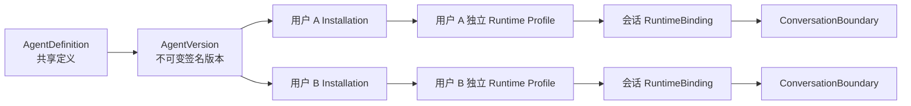

# 共享 Agent 边界、自动演化与闭环设计

## 文档状态与适用范围

本文是 2026-07-31 经用户确认的共享 Agent 总体设计基线，覆盖 Aera Desktop、Aera Runtime、Aera Cloud、Aera Admin，以及个人、工作空间、企业和官方 Agent 的资产发布、安装运行、经验沉淀、人工治理与版本发布。

本文描述目标架构和验收边界，不把 2026-07-31 的缺口清单当成静态开发任务。开发人员和开发智能体必须执行“动态开发协议”，在每个 Wave 和每个仓库开工前重新检查真实项目状态，只实现当时仍未闭环的增量。

本文确认并取代此前与下列决定冲突的设计检查点：

- 企业和官方版本只需要一名独立审核人作出一次有效决定；
- 提交者不得审批或驳回自己的提交；
- `lat.md/agentera-agent-control-plane.md` 当前允许企业提交者自审的描述不再有效；
- 旧规格中要求“两名审核人”或允许“提交者自审”的条款，由本文的“单人独立审核”规则取代。

## 目标

目标是按用户流程图形成一个可验证的共享 Agent 系统：共享 Agent 定义、不可变版本和获批资产，不共享任何成员的私有运行数据；保留 Hermes Profile 内本地自动学习，同时让可复用经验经过可靠候选、策略、DLP、评测、独立审核、导入、发布、灰度和回滚形成受控的跨边界演化闭环。

系统完成后必须同时满足：

1. 同一用户可安装和使用个人、工作空间、企业、官方 Agent，但每次安装均拥有独立的 USER-owned Runtime Profile。
2. AgentDefinition 和 AgentVersion 按 `owner_scope` 共享；Knowledge、Skill、SOP、Prompt、Rule 作为不可变 AgentVersion 的获批组件共享，会话、Memory、USER 数据、凭据、文件、私有 Skill 和本地反馈不得随之共享。
3. RuntimeBinding 和 ConversationBoundary 在新会话或隔离任务开始时分别冻结，后续版本更新不得改写已有会话。
4. 企业和官方发布都由一名非提交者审核，一次有效审批即可继续，一次有效驳回即进入终态。
5. Hermes 本地学习不依赖 Cloud；跨边界候选和发布不允许无人审核。
6. 每个重要状态必须有可恢复的失败语义、可重放的幂等语义和可追溯的审计证据。

## 2026-07-31 当前证据基线

本节是规划输入，不是永久事实。后续开发不得直接复用本节结论，必须按“动态开发协议”刷新。

### 总体判断

按完整流程图加权，当前完成度约为 50%–55%。权重口径为：资产与数据边界 20%、共享安装运行 25%、企业/官方治理 15%、自动演化 25%、发布级证据 15%；本次审计分别按约 80%、70%、45%、25%、40% 计分，得到约 52.5%。这个估算只用于排序，不是发布完成度或上线承诺；每次动态审计都必须用同一权重重算，不能沿用裸百分比。

| 领域 | 当前可确认的证据 | 当前分类 | 主要缺口 |
| --- | --- | --- | --- |
| 数据边界与 Profile 隔离 | 已有 USER-owned Installation、独立 Runtime Profile、RuntimeBinding 和 ConversationBoundary 代码及定向测试 | 候选代码与自动测试 | 仍需在最终合并状态验证历史安装、provider/model/credential 漂移和真实运行边界 |
| 个人 Agent 发布并使用 | 先前一次隔离真实模型 E2E 收到 marker；修复提交 `2520897` 已通过 PR #24 合并到远端 `main` 的 `99ec4b4` | 已合并候选代码 | PR CI 已通过，merged-main CI 正在运行；打包、正式 Cloud、真实设备及历史 active Profile 的执行前校验仍未闭环 |
| 企业共享 Agent | 先前四账号 E2E 覆盖提交、审批、安装、升级和撤权 | 候选闭环但治理不合格 | Cloud 当前主动允许提交者自审、自拒，违反本设计；真实部署 migration 与双账号验收未完成 |
| 官方 Agent | Cloud 已有版本、发布修订、暂停、恢复、回滚和质量提案基础 | 候选代码与自动测试 | Admin 与 Cloud 在状态、decision、channel、draft kind 和 `base_version_id` 上错位；质量工作台和真实角色隔离未闭环 |
| 本地自动学习 | Runtime 能在 Profile 内更新 Memory 和 Skill，保持 Hermes 本地行为 | 已有实现与定向测试 | 不能据此推导跨边界候选、评测、发布已实现 |
| 跨边界经验候选 | 已有人工选择 Skill、Desktop/Cloud DLP、人工审核和导入 Draft | 局部实现 | 只支持 Skill；Knowledge、SOP、Prompt、Rule、可靠事件队列和自动评测未实现 |
| E2E 生命周期 | 有长链路 Playwright harness 和若干脚本；同日早期审计发现 41 个 Runtime 孤儿进程和 34 个临时根，提交后刷新为 0/0 | 候选代码，生命周期风险未闭环 | 清理结果会随任务变化，但端口租约、外部 reaper、Docker 和异常退出清理尚未成为强制门禁 |
| 真实运行证据 | 历史隔离运行曾通过 | 证据冲突，按较低等级处理 | 较新的现场审计发现一个 `active` 企业安装因 provider 身份漂移出现 `No inference provider configured`，因此 `active`、绿色测试或历史 marker 均不能单独证明当前闭环 |

### 快照清单

本快照在 2026-07-31、本地提交 `2520897` 生成后刷新。命令包括各仓库的 `git branch --show-current`、`git rev-parse HEAD`、`git status --porcelain=v1`，定向测试命令记录在对应审计结果中；运行资源用带完整 command line 的 `ps` 和 `/tmp/agentera-agent-control-e2e-*` 计数复查。

| 仓库 | checkout / branch / HEAD | WIP 与运行证据 |
| --- | --- | --- |
| Desktop | `/Users/zizimutou/Desktop/aera/aera` / `aera/agent-use-e2e-fix` / `2520897435fc`；远端 `main` 已合并为 `99ec4b4` | 7 个与本规格无关的 tracked WIP、4 个既有 untracked 加本规格、0 staged；PR #24 的 7 项检查已通过，merged-main CI 尚未得到最终结论 |
| Cloud | `/Users/zizimutou/Desktop/aera/aera-cloud` / `main` / `df5ce5798bb7`，等于 upstream | 6 个既有登录提示 WIP；定向 Go 测试通过；未连接现有数据库验证 schema 21 的部署状态 |
| Admin | `/Users/zizimutou/Desktop/aera/aera-admin` / `main` / `06b73929ed45`，等于 upstream | checkout 干净；根集成测试 122 通过、1 跳过，Web 85 项和类型检查通过 |
| Runtime | `/Users/zizimutou/Desktop/aera/aera-runtime` / `aera/kanban-exit-status` / `dcb0f0bc6a0e`，无 upstream | 3 个既有 WIP；定向 Runtime 测试 32 项通过 |

当前没有可作为正式环境证据的长期 Cloud/Admin listener；官方 Agent 和 Official Quality flag 在代码默认值中均为关闭。Cloud Web 因本地依赖树残缺未完成测试，PostgreSQL/Redis integration test 受显式环境门禁控制，本轮没有将它们记作通过。提交后资源刷新看到 0 个匹配 Runtime 孤儿和 0 个对应临时根，但这不能抹去早期 41/34 的泄漏证据，只能说明运行现场已经变化。

本节没有持久化 Playwright report、部署 digest 或真实设备报告，因此历史 marker 和四账号 E2E 只作为候选证据。PR #24 的跨平台 CI 已通过，但 merged-main CI、部署和真机是不同证据层级。后续 Wave 0 必须建立仓库内 evidence ledger，记录命令、时间、退出码、artifact digest 和资源前后差值，才能升级证据等级。

### 证据分级

任何后续状态汇报必须使用以下等级，不得将较低等级表述为较高等级：

1. **已真实闭环**：最终候选提交已合并，干净环境 E2E 通过，真实依赖和真实身份通过，清理断言通过，所需部署或设备验收也已完成。
2. **仅有候选代码/自动测试**：工作区、分支或本地提交中有实现，单测、类型检查、构建或模拟 E2E 可能已通过，但尚未满足真实闭环条件。
3. **当前失败**：当前源码、运行态、数据库、契约或验收存在可复现失败。
4. **尚未实现**：找不到生产代码、数据模型、入口、运行证据或验收证据。

若证据冲突，使用较低等级。例如：一次旧的真实 E2E 通过与一次新的现场失败同时存在时，状态只能是“候选代码/当前失败待复证”，不能报“已闭环”。

## 强制动态开发协议

动态开发协议是所有 Wave 的开工门禁和验收门禁。计划中的文件名、任务数和工期可以随项目进度调整，但本设计的数据边界、独立审核和人工发布原则不得被调整。

### 每个 Wave、每个仓库开工前必须刷新

主集成智能体必须为目标仓库记录一份带时间戳的证据清单：

- checkout 的绝对路径、分支、HEAD、upstream 和 remote；
- tracked、untracked、staged WIP，以及与目标任务重叠的文件；
- 相关提交、PR、CI、合并状态和发布产物；
- 当前运行服务、进程、监听端口、Docker project 和临时根；
- 数据库 migration 版本、关键表结构、feature flag 和代表性非敏感行数；
- 目标路径的单测、契约测试、构建、E2E 和最近真实运行证据；
- 现有失败、跳过、环境阻塞及其归因；
- 其他任务在同一仓库、分支、worktree 或文件上的活动状态。

不得使用聊天记忆、旧计划、旧截图、旧测试日志或“代码看起来已经有了”代替该清单。

### 刷新后必须重新分类和重排

每个原计划事项都必须重新标记为“已真实闭环”“仅有候选代码/自动测试”“当前失败”或“尚未实现”，然后执行下列规则：

1. 已由其他任务完成的事项先在当前候选提交上复证；复证通过后删除、缩小或重排原任务。
2. 仅有候选代码的事项不重复实现，先补缺失的验证、集成或运行证据。
3. 当前失败的事项按根因拆分，不以重跑掩盖确定性缺口。
4. 尚未实现的事项才进入新功能开发。
5. 证据变化可以改变任务依赖、开发顺序、智能体分工和工期估算。
6. 任何调整不得扩大共享数据范围、允许自审、合并 RuntimeBinding 与 ConversationBoundary，或允许无人审核发布。

### 并发开发门禁

多智能体开发使用一个主集成智能体加最多三个开发智能体，并遵守：

- 大型 dirty WIP 未冻结、未提交、未明确文件归属前，不允许多个智能体直接修改同一 checkout。
- 每个开发智能体使用独立分支和隔离 worktree；同一文件只能有一个明确 owner。
- 主集成智能体负责契约、依赖顺序、证据账本、合并和最终验收，不在开发智能体活动期间修改其 owned 文件。
- 跨仓契约先冻结 canonical schema，再允许 Cloud、Admin、Desktop 并行。
- 发现重叠 WIP 时先停止对应写操作，保留现场，重新分配文件或等待前一任务形成可审查提交。
- 禁止把无关 WIP、临时锁文件、测试密钥、运行日志和临时根带入提交。

### 每个 Wave 结束时必须刷新

结束清单与开工清单使用相同字段，并增加：

- 候选提交、合并提交和实际 diff；
- 通过、失败、跳过和未运行的测试；
- 迁移、部署、签名、打包和真实设备状态；
- 进程、端口、Docker、数据库和临时根清理结果；
- 原任务中被删除、缩小、延后或新增的事项及依据；
- 下一 Wave 的最新工期区间。

## 不可变架构边界

### 可以共享的对象

只有经过策略、授权、DLP、评测和审核的不可变资产可以跨用户或租户边界共享：

- AgentDefinition 元数据；
- AgentVersion 及其签名、digest 和兼容约束；
- 获批的 Knowledge、Skill、SOP、Prompt、Rule；
- 发布、灰度、暂停、恢复和回滚修订；
- 内容最小化、脱敏后的评测与审计证据；
- 安装资格和版本可用性元数据。

### 永远不随 Agent 共享的对象

下列数据始终属于具体用户和本地 Runtime Profile，不进入共享 Agent 资产：

- `USER.md`、`MEMORY.md` 和其他 Profile-local Memory；
- 原始会话、消息、推理记录和未显式授权的反馈；
- 用户文件、客户资料、工作产物和私有 Knowledge；
- 模型、工具、OAuth、API key 和其他凭据；
- 私有 Skill、SOUL、Profile 配置和本地自适应状态；
- Runtime 进程、端口、日志和本地路径；
- 未通过显式候选流程的任何经验数据。

不得用共享 `USER.md`、全局 `HERMES_HOME`、完整 Profile 克隆或后台全量同步模拟共享记忆。

### 资产所有权

`owner_scope` 只描述 AgentDefinition、AgentVersion 和获批资产的来源所有权：

- `USER`：个人资产；
- `WORKSPACE`：工作空间资产；
- `ORGANIZATION`：企业资产；
- `PLATFORM`：官方平台资产。

无论来源范围如何，以下对象始终为 USER-owned：

- Installation；
- Runtime Profile 和物理 `HERMES_HOME`；
- RuntimeBinding；
- ConversationBoundary；
- Session、Memory、Files、Credentials 和私有学习。

`source_scope` 可以作为目录和审计来源记录，但不得改变运行数据的所有权。

### 五类资产的 canonical 模型

本闭环不新增五套可独立发布的 owner-scoped 资产库。Knowledge、Skill、SOP、Prompt、Rule 在编辑阶段是 Draft component，在提交后以内嵌 manifest/bundle component 的形式进入不可变 AgentVersion，并继承目标 AgentDefinition 的 `owner_scope`。

每个 component 使用 `{kind, component_id, revision, digest}` 标识。AgentVersion manifest 必须完整引用具体 revision 和 digest；删除或替换 Draft component 不删除已发布版本中的历史 bytes。候选记录可以独立存在，但只表示“建议合入哪个目标 Draft”，不能被 Runtime 直接执行，也不能跨 owner scope 被另一个版本引用。

### Installation、RuntimeBinding 与 ConversationBoundary

三者职责必须分离：

- **Installation**：一个用户、设备和 Agent 的安装实例，选择可用的不可变版本、更新策略和本地 Runtime Profile。
- **RuntimeBinding**：一个新会话或隔离任务的执行快照，冻结 Definition、Version、Installation、Runtime、Profile、policy、版本化 model route 和 tool digest。
- **ConversationBoundary**：同一会话的数据与权限快照，冻结 actor、当前产品上下文、可见性、Memory/File/Artifact 所有权和工具权限。

新版本只影响准备完成后创建的新 RuntimeBinding。已有 RuntimeBinding 和 ConversationBoundary 不随工作空间切换、版本更新、灰度、回滚或成员移除被改写。

RuntimeBinding 的 model route 固定保存 canonical provider namespace/runtime id、规范化 endpoint、API mode、model id、credential kind、USER-owned credential handle 和不可逆 fingerprint，绝不保存 secret。执行旧 Binding 时使用该 Binding 的版本化 route，不重新读取 Profile 的可变默认 route；credential 被撤销、过期或不可解析时只拒绝当次执行，不改写旧快照。

对 installed-Agent conversation，RuntimeBinding 和 ConversationBoundary 使用同一 conversation id/idempotency key 在一个本地事务中提交；若物理存储不能共享事务，则必须使用 durable coordinator，使两者最终同时存在或同时不存在。两者的 owner、Installation、Profile、Version、policy/tool digest 必须一致。动态撤权可以阻止执行，但不能修改已冻结的任一快照。

图中的两个 Installation、Profile、RuntimeBinding 和 ConversationBoundary 互不共享；它们只引用同一个经过验证的不可变 AgentVersion。

## 授权、策略与单人独立审核

### 有效策略

执行和发布均采用 fail-closed 的策略交集：

`effective_policy = platform_policy ∩ tenant_policy ∩ user_permission ∩ signed_version_policy ∩ installation_policy ∩ runtime_capability`

任一层未知、过期、签名不匹配或明确拒绝时，不得通过更宽松的另一层覆盖。

### 企业版本审核

企业提交由一个 active Owner 或 Admin 审核，且审核人必须与提交者不同。

- 一次有效 `approve` 即可原子生成或激活对应不可变版本；
- 一次有效 `reject` 即进入拒绝终态；
- 提交者不能审批，也不能驳回自己的提交；
- Auditor 只读，Member 不能审核；
- 如果企业只有一个符合角色的人，提交保持待审核，不能降级为自审；
- 审核事务必须重新检查 Membership、角色、企业生命周期、policy、DLP、base revision、幂等键和提交 digest；
- service/repository 拒绝与数据库约束必须形成双防线；
- 重复的同一决定幂等返回，冲突决定失败且不得生成第二个版本。

### 官方版本审核

官方版本由 Developer 创建和提交，由一名不同身份的 Super Admin 审核。

- 一名独立 Super Admin 的一次有效决定足够；
- Developer 和提交者不得审核或驳回自己的提交；
- Operator 管理已批准发布的 rollout、pause、resume，并发起 rollback request；
- rollback request 由一名不同身份的 Super Admin 批准或驳回；批准后由该 Super Admin 身份通过 Cloud authoritative CAS 执行，Operator 不能自行批准；
- Auditor 只读；
- 任何 BFF 不能按操作临时伪装角色，Cloud 必须验证真实员工身份和职责；
- rollout 或 rollback 不反向修改已存在的用户 RuntimeBinding。

“单人审核”表示需要一个审核人，不表示提交者可以自己审核，也不表示同一账号可以在不同接口中切换角色绕过职责分离。

### 个人与工作空间边界

个人 Agent 的本地使用和个人发布不强制增加企业级独立审核。工作空间 ExperienceCandidate 继续由有权限的 Owner/Admin 审核；若未来将工作空间发布扩展为高风险跨组织分发，应另行升级职责分离规则，不在本设计中暗中扩大。

### 候选目标与审核矩阵

每个跨边界候选 envelope 必须包含 `source_scope`、`source_reference`、`target_scope`、`target_definition_id`、`base_version_id`、candidate kind、payload digest 和 provenance。Profile 候选的 `source_reference` 是 USER-owned `source_installation_id`；官方质量提案的 `source_reference` 是受抑制聚合的 `quality_aggregate_id`，两者不能混用。

| 推广路径 | 谁可提交 | 谁审核 | 审批结果 |
| --- | --- | --- | --- |
| USER-local → USER Draft | 当前用户显式确认 | 不增加 Cloud reviewer | 导入本地个人 Draft，仍需人工发布 |
| USER Profile → WORKSPACE Draft | 当前 Workspace active member | 一名有权限的 Owner/Admin；按现有 Workspace V1 不强制与提交者分离 | 导入指定 Workspace Draft，仍需正常发布 |
| USER Profile → ORGANIZATION Draft | active employee 且目标策略允许 | 一名与提交者不同的 active Owner/Admin | 导入指定 Organization Draft，随后走独立发布 Submission |
| Official Quality aggregate → PLATFORM Draft | Developer 从获批 proposal 发起 | 一名与 proposal 创建者不同的 Super Admin | 显式 clone 到官方 Draft，随后走官方发布审核 |

普通 USER/WORKSPACE/ORGANIZATION candidate 不得直接把 `target_scope` 设为 PLATFORM。审核批准只允许导入目标 Draft，不允许候选直接生成 release。

## 综合自动演化

### 两条独立演化环

系统保留两条互不替代的环：

1. **Profile 内本地学习环**：Hermes 在完成 turn 后按现有行为更新当前 Profile 的 Memory 或本地 Skill。Cloud 不在线、候选失败或审核拒绝均不得回滚本地学习。
2. **跨边界受控推广环**：从本地学习结果或获准的官方质量数据生成最小候选，经 DLP、评测和人工治理后进入新的不可变版本。

跨边界环不能拦截、延迟或替代本地学习，也不能默认上传原始会话。

```mermaid
flowchart LR
    L["Profile 内本地学习"] --> E["可靠演化事件"]
    E --> C["五类 ExperienceCandidate"]
    C --> LD["本地 DLP 与脱敏预览"]
    LD --> CD["Cloud 重扫与授权"]
    CD --> Q["自动评测与证据"]
    Q --> H["按 target matrix 的人工审核"]
    H --> DR["导入可编辑 Draft"]
    DR --> PV["人工发布不可变版本"]
    PV --> RO["人工启动 rollout / 可回滚"]
    RO --> NI["仅新 Installation 或新会话采用"]
```

### 可靠 Runtime 事件

Runtime 不再依赖“用户打开 UI 后扫描目录”作为长期候选来源。每个可推广结果写入 Profile-local、可重放的 outbox：

- 事件含 schema version、event id、Profile-local source id、kind、content digest、provenance、created time 和最小风险元数据；
- 不含原始会话、凭据、Profile 路径或未脱敏内容；
- 交接状态为 `pending → staged → acknowledged`，或在来源失效时进入 `tombstoned`；
- Desktop 只有在 AgentEra-owned 暂存区已 durable commit 并复核 source digest 后才发送 ack；“读取成功”或“Cloud 提交成功”都不是 Runtime ack 的边界；
- 重复消费按 event id 和 digest 幂等，`staged` 记录必须能在 Desktop 重启后恢复；
- Runtime/Cloud 不可用时事件保留并退避重试，不影响前台 turn；
- 每次 staging 或提交前重新校验 source digest；用户删除或修改本地学习结果后，旧事件 tombstone，未提交候选不得继续上传；
- 事件只有在用户授权准备候选后才复制到 `HERMES_HOME` 外的 AgentEra-owned 暂存区。

### 五类候选

五类候选共用 target-aware envelope、授权、DLP、评测证据、审核和审计协议，但 payload、合并和回滚语义必须分开。它们最终成为目标 AgentVersion 的内嵌 component，不成为独立可执行 owner-scoped 对象。

| 类型 | 最小 payload | 必须评测 | 合并和回滚 |
| --- | --- | --- | --- |
| Knowledge | 正文片段、来源、引用、许可、有效期、语言和 digest | 引用可达性、事实一致性、时效、PII 和版权风险 | 按来源和 digest 去重；版本回滚恢复旧知识集合 |
| Skill | allowlist 文件、入口、权限、依赖、生成来源和测试 | 沙箱执行、权限最小化、恶意内容、确定性和兼容性 | 同名冲突必须显式替换；旧版本保留原 Skill |
| SOP | 有序步骤、前置条件、人工门禁、失败补偿和完成条件 | 路径覆盖、不可逆动作、权限、超时和补偿可达性 | 按 SOP revision 替换；运行中的任务保持原 revision |
| Prompt | 模板、变量 schema、适用阶段、安全约束和语言 | 基准集质量、注入抵抗、越权、稳定性和成本 | 按模板 revision 选择；回滚不修改既有会话 prompt |
| Rule | 条件、动作、优先级、deny/allow、fail mode 和适用工具 | 冲突、循环、默认拒绝、权限扩大和策略兼容 | deny 优先；新规则只进入新 policy snapshot |

不得把 Memory 或 USER 数据改名为 Knowledge 以绕过边界。Knowledge 必须是用户明确选择且能展示来源和脱敏预览的可共享内容。

### 自动化与人工门禁

系统可以自动执行：

- 从可靠事件生成本地候选；
- 分类、去重、规范化和风险评分；
- 高置信 DLP 检测和脱敏建议；
- 离线 benchmark、兼容性、安全和回归评测；
- 证据聚合、重试、状态同步和 rollout 监测；
- 生成回滚建议。

系统必须等待人工执行：

- 首次跨边界提交和最终脱敏预览确认；
- 按 target matrix 完成审核；企业或官方必须由一名非提交者 approve/reject；
- 将获批候选导入哪个 Draft；
- 发布新的不可变 AgentVersion；
- WORKSPACE/ORGANIZATION 采用新版本；PLATFORM 启动、扩大、暂停或回滚 rollout。

系统不允许因评分达标而直接跨边界发布，也不允许后台将个人 Agent 数据自动送入官方改进管线。

### DLP 与脱敏

本地和 Cloud 各自执行版本化 DLP，任何一端通过都不能跳过另一端。

- 本地先显示逐字段脱敏预览和风险原因，再允许用户确认；
- Cloud 只接收已脱敏 canonical payload，并重扫 digest 和 provenance；
- 高风险 secret、credential、私钥、认证 token 和不可解释 PII 默认拒绝，不能只做掩码后继续；
- 可脱敏 PII 生成明确 redaction map；map 只含字段路径、offset、规则 id 和原文 hash，不含原文或可逆替换值；
- reviewer detail API 只返回脱敏 bundle，不提供获取原始 bundle 的旁路；
- 原始内容不写入日志、审计、错误消息或遥测；
- scanner 版本、规则命中、人工决定和最终 digest 写入审计。

### 评测证据

每个候选和每个待发布版本都有不可变 `EvaluationEvidence`：

- candidate/version digest；
- evaluator 和规则版本；
- benchmark、回归、安全、成本和兼容性结果；
- 测试环境、时间、重试次数和已知限制；
- pass/fail/waived，以及 waiver 的独立 actor 和原因；
- 与审核决定、发布修订和 rollback 原因的关联。

Draft 内容、candidate/version digest、DLP/evaluator/policy 版本或兼容环境发生变化时，旧证据立即失效并必须重评。waiver 记录独立 actor、权限、原因、适用 digest 和过期时间；不能由候选提交者自己签发，也不能跨 digest 复用。

评测失败不能自动发布。评测结果只证明被测候选，不证明部署、签名、安装或真实设备通过。

## 官方 Agent 改进管线

官方改进只处理用户明确 opt-in 且属于官方 Agent 的最小质量数据。个人、工作空间和企业自建 Agent 数据默认不进入官方管线。

管线顺序为：

1. 收集允许的内容最小化运行指标、错误类别和显式反馈；
2. 达到匿名聚合阈值前保持抑制；
3. 匿名化、DLP 和安全审查；
4. 生成 content-free 质量聚合证据；
5. Developer 人工创建改进 proposal；
6. 一名不同身份的 Super Admin 审核；
7. Developer 将获批 proposal 显式克隆到官方 Draft；
8. 经过同一评测、签名、发布和 rollout 门禁生成新版本。

质量 proposal 本身不能发布、修改 OfficialRelease 或写回用户 Profile。Wave 0–3 只允许当前 content-free envelope：标识、bucket、固定结果/反馈码和设备签名，不收集案例正文。任何案例内容都属于后续独立 RFC，必须使用独立 purpose consent、endpoint、store、TTL 和 purge，且不得复用默认指标 envelope。

## 状态机与不可变版本

### ExperienceCandidate

主路径：`detected_local → prepared_local → submitted → under_review → approved → imported_to_draft → incorporated`

终态分支：`prepared_local | submitted | under_review → withdrawn`，以及 `under_review → rejected`。`rejected` 和 `withdrawn` 永远不能进入 `imported_to_draft`。

- `detected_local` 和 `prepared_local` 只在本地；
- `submitted` 后 canonical payload 不可变；
- `approved` 只授权导入，不自动发布；
- `imported_to_draft` 可重复请求但只能指向同一导入记录；
- `incorporated` 记录最终 AgentVersion，不删除来源 Profile 的本地学习结果。

### 企业与官方发布 Submission

`draft_local → prepared → submitted → approved | rejected | withdrawn | superseded`

- submitted snapshot 不可变；
- approve/reject 都要求一名与提交者不同的独立审核人；本状态机不改变个人发布和当前 Workspace V1 规则；
- 一个 submission 最多生成一个不可变版本；
- 审核事务发现 `base_version_id` 或 head revision 已变化时原子标记 `superseded`，不记录 approve/reject、不生成版本；提交者只能基于新 head 创建新 submission；
- 决定事务同时写 version、decision、audit 和 outbox，不能出现版本已生成但审计缺失。

### Installation

创建主路径：`pending → materializing → active`

更新路径：`active → update_pending → materializing → active`

修复路径：`active | materializing → repair_required → materializing → active | failed`

撤权路径：`pending | active | update_pending | repair_required → revoking → revoked`

归档路径：`failed | revoked → archived`；被新发布版本取代且尚未物化的 `pending` Installation 可以带 `superseded` reason 直接归档。

- `active` 只表示物化、签名、policy、model route 和 Cloud activation 已成功，不表示真实模型永远可用；
- 每个新会话仍执行 provider/model/credential 与签名版本的一致性 gate；每个已绑定 turn 仍执行动态 entitlement、revocation 和 credential 可解析检查；
- 可恢复错误进入 `repair_required`，不能伪装成 active；
- repair 使用 per-Installation lock 和 revision CAS；旧 Profile 已产生 Memory 时必须复用同一 Profile，禁止默默新建并丢弃学习；
- update 失败且旧 active 版本仍完整时回到旧 `active` 并保留失败证据；旧版本已不可执行时进入 `repair_required`；
- 最终失败必须有 durable cleanup record，直到 Profile、binding、端口和数据库状态一致。

### Official Quality Proposal

主路径：`open → submitted → approved → draft_linked → closed`

拒绝终态：`submitted → rejected`

- `rejected` 为终态；重新提案必须创建新 proposal；
- approved clone 失败时保持 `approved` 并记录可重试 import attempt，不创建第二个 Draft；
- `draft_linked` 记录唯一 Draft id 和 base version；
- 只有关联 Draft 已发布、明确放弃或因新 head 永久失效时才能进入 `closed`；
- proposal 创建者不能审核自己的 proposal。

### Admin Rollback Approval

`requested → approved | rejected | cancelled`

执行分支：`approved → executing → executed | reconcile_required → executed`

- Operator 创建 request，只能在 `requested` 时取消；
- 一名不同身份的 Super Admin approve/reject；批准后以真实 Super Admin 身份执行 Cloud rollback CAS；
- 开始执行后不能取消；
- Cloud 成功而 Admin 本地落库失败时进入 `reconcile_required`，durable outbox/reconciler 用原 idempotency key digest 查询 authoritative ReleaseRevision；
- reconciler 确认 Cloud 已成功后标记 `executed`；未成功时只能用同一 idempotency operation 重试，不能生成第二次 rollback；
- `rejected`、`cancelled` 和 `executed` 为终态。

### Release

AgentVersion 永远不可变；rollout、pause、resume 和 rollback 只创建 append-only ReleaseRevision。

- 发布 head 用 compare-and-swap 防止并发覆盖；
- rollback 选择一个既有已签名版本，不能修改旧版本内容；
- pause 停止新发现、新安装和新更新，不远程删除已安装 Profile；
- rollback 和 update 只影响完成本地验证后的新会话；
- Admin 本地状态必须与 Cloud authoritative revision 对账，不能在 Cloud 成功后长期停留于旧批准状态。

## 事务、补偿与失败语义

### Cloud 原子事务

每个提交、审核、版本生成、release revision 和 rollback mutation 必须在同一数据库事务中：

- 锁定并重查目标 revision；
- 验证真实 actor、角色、提交者分离、policy 和 idempotency key；
- 写业务状态；
- 写 append-only audit；
- 写可靠 outbox；
- 提交后才对外返回成功。

外部事件发布失败由 outbox 重试，不能回滚已提交事务，也不能丢失审计。

### Desktop 安装 Saga

安装和更新按 durable operation id 执行：

1. 写入 pending Installation 和 cleanup journal；
2. 预留确定性 Profile id/path，或在创建第一个 Profile 文件前写入不可变 operation marker/index；
3. 创建新 USER-owned Profile，或显式 claim 已有 Profile，并在 journal 记录 `created_by_operation` 或 `claimed_existing`；
4. 绑定签名版本允许的 canonical provider/model route 和 USER-owned credential reference；
5. 验证签名、digest、policy、Runtime、assets 和 tools；
6. 建立 Profile binding；
7. 使用 operation id 作为 Cloud activation idempotency key；
8. 原子标记 active 并完成 journal。

在任何副作用发生前必须存在 journal，因此即使 `createProfile()` 在返回 Profile ID 前失败，也能通过 operation marker/index 找到残留。清理前重新校验 tenant、owner、device、Installation、operation token 和物理路径；`claimed_existing` Profile 在任何失败路径都不得被删除。

- Profile 尚未产生私有状态且 `created_by_operation=true` 时，失败补偿删除本次创建的 Profile 和 binding；Installation 进入 `failed → archived`，不物理删除失败历史。
- Profile 已物化或可能已有 Memory 时，失败保留 Profile，进入 `repair_required` 并复用原 Profile 重试。
- 删除或解绑失败不能只写日志；journal 保持未完成并由明确的 repair/cleanup worker 重试。
- 任何重试都不得创建第二个 Installation 或第二个 Profile 来掩盖原失败。
- 每个 phase durable commit；若 Cloud activation 已成功但 Desktop 在标记 active 前崩溃，启动时 reconciler 用同一 operation id 查询 activation status，并收敛到唯一 active Installation/Profile 或继续补偿。
- AgentVersion、Cloud、审计和跨用户安装永远不携带 credential value；本机只解析当前用户自己的 credential handle。

### 执行前一致性 gate

canonical route 比较固定使用 provider namespace/runtime id、规范化 endpoint、API mode、model id、credential kind/ref/fingerprint。display name、仅 model id 或未规范化 base URL 不能用于等价判断。

创建新 RuntimeBinding 时执行完整 gate：

- Installation 当前状态、entitlement、签名 AgentVersion 和 policy snapshot；
- Runtime 兼容性、tool digest 和完整 canonical route；
- credential handle 能在本机解析、未过期且 fingerprint 匹配；
- ConversationBoundary 的 actor、context、visibility 和绑定一致性。

每次执行已绑定 turn 时只重新检查动态 entitlement、revocation、credential 可解析性和当前 Runtime 可用性；失败拒绝执行但不改写快照。真实上游健康检查属于运行探测，不是每次创建 Binding 的确定性前置条件。

provider identity、endpoint、API mode、model 或 credential fingerprint 的漂移都不能仅凭 Installation 为 `active` 放行。所有 Chat、Kanban 和其他运行入口必须调用同一个 main-process gate，不能依赖用户先进入 Agents 页。可修复历史 active 安装通过 per-Installation lock/CAS 进入 `active → repair_required → materializing → active`，保留 Profile id 和 Memory；不可修复漂移 fail closed，并给出不含 secret 的 error id。

### E2E 生命周期

每次 E2E 运行拥有唯一 run root、外部 supervisor/reaper、run manifest、PID inventory、动态端口租约和 Docker project。

- setup 前记录端口和进程基线；
- issuer origin、gateway、dashboard 和 Cloud listener 全链路可注入；使用持有 socket 的 port broker/lock 或 bind-and-retry，禁止“探测空闲后立即释放”；
- run manifest 在启动子进程前 durable 写入 PID、进程启动时间、executable、run ownership token、端口、Docker project 和 run root；
- 进程内 teardown 处理正常退出和可捕获 signal；测试 runner 崩溃或遭 SIGKILL 时，由 runner 外部 supervisor 和 CI `if: always()` leak auditor 回收；
- 回收 PID 前校验 run root、启动时间、executable 和 ownership token，防止 PID 重用误杀；
- 删除临时数据库前断言零非预期 `pending/repair_required`、零未完成 journal、零孤儿 Profile/binding/boundary，并确认模型 marker 属于本次 Installation/Binding；
- teardown 后再断言 run root 下进程为 0、端口已释放、Docker container/network/volume 和 project 已移除、临时数据库与 run root 已删除；
- cleanup 失败使 E2E 失败，不能 best-effort 吞掉；
- mandatory live gate 缺少 credential 或其他真实依赖时 preflight 失败，不能 skip 后仍把 release gate 报为通过；
- 独立孤儿检测工具只报告和清理明确属于某次 run root 的资源，不扫描或终止不相关开发进程。

## 契约与审计

### Canonical 契约

Cloud OpenAPI 和 versioned event schema 是跨仓 wire contract 的唯一权威来源。

- Admin 和 Desktop 使用生成类型或 contract test，不复制自由字符串；
- `pending`、`approve/reject`、`internal/stable`、`initial/next` 和 `base_version_id` 等字段由 schema 固定；
- Cloud handler、OpenAPI、Admin client 和测试 fixture 的 digest 必须一致；
- schema 变更先版本化，再并行修改消费者；
- 旧客户端的兼容窗口、拒绝语义和 migration 顺序必须写入 release evidence。

### 审计

审计记录至少包含：

- actor、真实角色、提交者、审核者；
- owner scope、tenant、Definition、Version、Candidate 和 ReleaseRevision；
- before/after state、content digest、policy snapshot 和 DLP/evaluator 版本；
- `idempotency_key_id` 与 HMAC/digest、request id、error id、时间和理由；原始 idempotency key 不写入 append-only 审计；
- rollout、pause、resume、rollback 和 repair/cleanup 结果。

Cloud 业务审计 fail closed，Cloud transactional outbox 与业务状态同事务提交。Admin 本地审计失败必须进入 durable、可见的 outbox、reconciler 和告警，不得静默忽略；Cloud authoritative 审计仍作为最终事实来源。

## 开发 Wave

Wave 是高层交付顺序，不是固定任务清单。每个 Wave 首先执行动态开发协议，然后删除已经闭环的工作、缩小候选代码的验证任务，只开发真实差距。本文批准后不生成一个覆盖所有仓库的超大实现清单，而是按下述 Wave 分别生成、复审和执行实施计划。

### Wave 0：基线冻结与契约校准

目标是让多智能体可以安全并行，并消除“旧计划覆盖新事实”。

交付：

- 冻结每个仓库的 checkout、branch、HEAD、WIP、服务、数据库、测试和 CI 清单；
- 复证远端 `main@99ec4b4`、merged-main CI 及其他并行任务产出，将已完成内容从后续任务删除；
- 为 Desktop、Cloud、Admin、Runtime 建立独立 worktree 和文件 owner；
- 同步 LAT 中“企业提交者可自审”的旧检查点，并补齐个人真实 E2E 当前缺失的 `Release gate#Personal publish and use` 章节；
- 冻结 Cloud OpenAPI、Runtime event、candidate envelope 和评测证据 schema；
- 建立进程、端口和临时根的只读基线检查；
- 建立仓库内 evidence ledger，固定命令、时间、退出码、artifact digest、skip 和资源前后差值；
- 生成最新缺口矩阵和工期。

Wave 0 不以继续堆功能为目标。WIP 未冻结或 contract 未定稿时，不启动并行生产代码修改。

### Wave 1：共享 Agent P0/P1 闭环

目标是让个人、企业和官方 Agent 的发布、审核、安装、使用和回滚具备一致边界和真实验收。

动态审计后仍存在时，优先完成：

- Cloud 企业 approve/reject 的提交者分离和前向 migration；
- Admin 与 Cloud 官方 Agent contract 对齐及生成式 contract gate；
- 建立真实员工角色映射，移除 BFF 按操作伪装 `developer/operator/super_admin` 的路径；
- 实现 Cloud transactional outbox，以及 Admin 审计和 rollback 的 durable outbox/reconciler；
- Desktop 新会话 provider/model/credential gate、历史 active repair 和 durable cleanup journal；
- 安装 Saga 的 Profile 创建前 journal 与 orphan 补偿；
- E2E 动态端口、进程组、异常 teardown 和零残留断言；
- ExperienceCandidate、Organization Agent、Official Managed Agent 进入 mandatory clean-checkout CI；
- 在隔离本地环境用两个不同测试身份完成独立审核，真实模型返回 marker，升级、撤权、暂停和回滚通过。

Wave 0 与 Wave 1 的净开发和自动化验证预计 3–5 个自然日，前提是最多三个隔离开发智能体并行，当前候选提交可复用，且不等待部署、签名和用户真机。若刷新证明相关任务已闭环，工期必须缩短。

### Wave 2：五类自动演化

目标是把“仅人工 Skill 候选”扩展为可靠、可评测、可审计的综合演化管线。

动态审计后仍存在时，完成：

- Runtime Profile-local 演化 outbox 与 Desktop ack；
- Knowledge、Skill、SOP、Prompt、Rule 五类 versioned component payload 和 target-aware envelope；
- 本地预览、DLP、redaction map、Cloud 重扫和 provenance；
- 每类候选的 benchmark、安全、兼容和回归 evaluator；
- candidate 状态机、幂等提交、独立审核、Draft 导入和版本关联；
- Desktop/Admin 审核与证据界面；
- 使用生产入口生成的显式授权验收数据完成从本地学习到新版本的闭环，但发布和版本采用/rollout 仍由人执行。

净开发和自动化验证暂估 3–5 个自然日，可在 Wave 1 contract 冻结后由 Runtime、Desktop 和 Cloud 分仓并行。该区间假设复用现有 manifest/bundle、DLP、Draft 和审核基础；Wave 0 若发现需要新增独立资产库或迁移现有数据，必须重新估算而不能硬守本区间。

### Wave 3：官方改进与生产级闭环

目标是把官方质量数据、proposal、版本和 rollout 连接起来，并完成发布级证据。

动态审计后仍存在时，完成：

- Admin 官方质量聚合、proposal、review 和 clone-to-draft 工作台；
- 评测证据成为发布门禁；
- feature flag、rollout、pause、rollback、Cloud/Admin 对账和告警可观测；
- 正式 migration、预发布服务、签名包、真实账号、两台真实设备和升级/回滚验收作为独立发布验收阶段；
- 证明官方数据 opt-in、匿名阈值、保留删除和自建 Agent 默认排除。

净开发和自动化验证暂估 2–3 个自然日，可与 Wave 2 后半段部分重叠。预发布部署、真实账号和两台设备验收在依赖准备完毕后另需约 1–3 个自然日；证书/签名申请、外部分发审核和第三方故障没有可控上限，不纳入此区间。

在一个主集成智能体加最多三个隔离开发智能体的前提下，Wave 0–3 的净开发和自动化验证预计为 8–12 个自然日；这是基于当前可复用基础的规划区间，不是固定承诺。依赖准备顺利时，预发布与真机验收另需约 1–3 个自然日；证书/签名申请、应用商店或分发审核、外部服务故障没有固定工期。每个 Wave 开工前都必须按实际进度缩短、延长或重排。

## 多智能体职责

四个并发槽位按 Wave 动态分配：

1. **主集成智能体**：刷新证据、冻结契约、维护依赖和证据账本、审查 diff、顺序合并、运行最终全量验收。
2. **Desktop/E2E 智能体**：Installation Saga、执行前 gate、ConversationBoundary、UI、真实模型和零残留 E2E。
3. **Cloud 智能体**：schema、migration、独立审核、candidate、评测证据、release、outbox 和 Cloud 审计。
4. **Admin/Runtime 智能体**：Wave 1 优先 Admin contract 与治理 UI，Wave 2 转为 Runtime 演化事件和五类提取；同一时段只拥有一个明确仓库边界。

如果某一仓库的真实工作量不足，释放对应智能体，不为保持并行而制造重复任务。

## 测试和验收门禁

### 每个开发切片

- 先有失败测试或可复现运行证据，再修改生产代码；
- 定向单测、类型检查、静态边界和 contract test 通过；
- `git diff --check` 通过；
- 不包含 secret、临时产物和无关 WIP；
- 对应 LAT 和 schema 同步；
- 在独立 worktree 复证候选提交。

### 每个 Wave 的能力矩阵

每个 Wave 只验收该 Wave 已交付的能力，禁止用后续能力的 fixture 凑门禁：

- Wave 0：四仓 manifest、WIP ownership、canonical schema、LAT、evidence ledger 和基线资源检查通过；
- Wave 1：目标仓库完整测试/构建、前一正式 schema 升级、跨仓契约、独立审核、安装/修复、真实模型和零残留 E2E 通过；
- Wave 2：五类候选分别用生产入口生成的显式授权验收数据，完成 outbox、DLP、评测、审核、Draft、Version 和对应 target scope 的版本采用；不得使用真实用户私有数据；
- Wave 3：Official Quality、proposal、真实角色、官方发布修订、rollback reconcile、feature flag、告警和 PLATFORM rollout 通过。

适用于该 Wave 的失败注入覆盖网络中断、重复请求、并发决定、角色变化、DLP 拒绝、activation 失败和 cleanup 失败。所有跳过和未运行项明确列出，不能计入通过。

### 最终发布级验收

最终不能只用绿色 CI 宣称完成，必须分别提供：

1. 最后一次 merge/deploy 后生成 fresh-audit manifest，固定 Desktop、Cloud、Admin、Runtime commit tuple、clean status、migration version、部署/安装包 digest、环境、命令、退出码、skip 和资源前后差值；
2. mandatory CI 和干净环境长链路 E2E；
3. 两个不同真实身份的一次独立审核，且提交者自批、自拒均失败；
4. 真实模型返回预期 marker，重启后仍可继续使用；
5. 两台真实设备上的发现、安装、升级、撤权、灰度和回滚；
6. 从前一正式 schema 升级历史 active 安装并修复 provider 漂移，Profile id 与 Memory hash 不变；既有会话使用旧 RuntimeBinding 的版本化 route，新会话采用新版本；
7. Memory、USER、文件、凭据和私有 Skill hash 在共享、升级和回滚前后保持隔离；
8. 五类候选各至少一条由生产入口生成的显式授权验收数据走完 DLP、评测、审核、Draft 和版本；WORKSPACE/ORGANIZATION 验证版本采用，只有 PLATFORM 验证 OfficialRelease rollout；
9. 测试运行和应用退出后零 owned 孤儿资源；
10. 签名、部署、feature flag、监控、告警和 rollback runbook 可用。

## 明确非目标

本设计不包括：

- 账户级全局 Memory 或共享 `USER.md`；
- 完整 Profile 克隆和跨用户 `HERMES_HOME` 同步；
- 默认上传原始会话、客户文件或私有反馈；
- 让 Cloud 取代 Hermes 本地 background review；
- 无人审核的候选导入、版本发布或 rollout；
- 自动修改正在运行的会话；
- 用大模型微调或训练替代 Knowledge、Skill、SOP、Prompt、Rule 的版本化资产；
- 用测试 fixture、`active` 数据库状态、一次旧 E2E 或打包成功代替真实发布验收。

## 完成定义

只有以下条件同时成立，才能说本流程图已经与实际项目闭环：

- 图中的资产、授权、安装、运行、演化和官方改进路径均有生产实现；
- 数据边界和单人独立审核在 service、repository、数据库和真实身份验收中一致；
- 五类候选具有可靠事件、DLP、评测、审核、导入、版本，以及按 target scope 的版本采用或 PLATFORM rollout 证据；
- 所有重要失败都有补偿、重试、对账和审计；
- 当前合并提交在干净环境、真实依赖、真实账号和真实设备上通过；
- 测试和应用生命周期没有 owned 孤儿资源；
- 最新证据清单没有把候选代码、自动测试、跳过项或历史结果误报为真实闭环。

后续详细实施计划必须从最新证据清单生成，而不是逐条机械复制本文 Wave 中的 2026-07-31 缺口。计划拆分为：Wave 0–1 共享 Agent P0/P1、Wave 2A 演化 outbox 与通用候选框架、Wave 2B 五类 component adapter、Wave 3 官方改进与发布验收；每一份计划开始前重新审计并等待上一份的真实证据。
